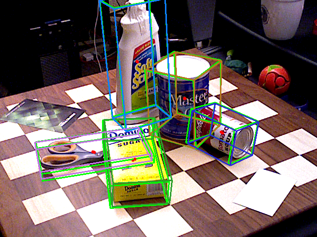

# YOLOX based Models
This repository contains the following enhancements of the YOLOX repository:
* **Ti-lite 2D Detection** 
    * These YOLOX based 2D detection models are optimized for TI processors. 
    * Refer to this [readme](./README_2d_od.md) for further details.

* **6D Pose Estimation** 
    * 6D pose estimation or object pose estimation aims to estimate the 3D orientation and 3D translation of objects in a given environment.  In this work, we propose a multi-object 6D pose estimation framework by enhancing the YOLOX object detector. The network is end-to-end trainable and detects each object along with its pose from a single RGB image without any additional post-processing.
    * Refer to this [readme](./README_6d_pose.md) for further details.

* **Human Pose Estimation** 
    * Multi person 2D pose estimation is the task of understanding humans in an image. Given an input image, target is to detect each person and localize their body joints. In this work, we introduce a novel heatmap-free approach for joint detection, and 2D multi-person pose estimation in an image based on the popular YOLO object detection framework. 
    * Readme for this task is under construction.

### Sample Inferences
* Given below are sample inferences for the tasks of human pose estimation and 6d pose estimation.

     Human Pose Estimation   | 6D Pose Estimation 
    :-------------------------:|:-------------------------:
     | 