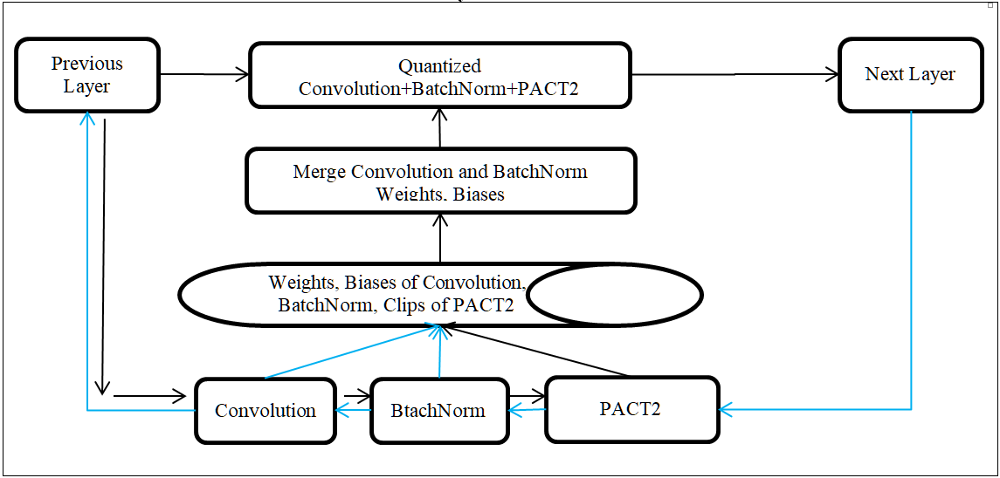
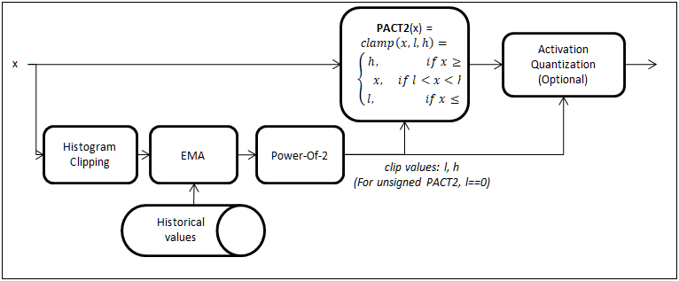

# Quantization

Quantization of a CNN model is the process of converting floating point data & operations to fixed point (integer). This includes quantization of weights, feature maps and all operations (including convolution). The quantization style used in this code is **Power-Of-2, Symmetric, Per-Tensor Quantization** for both **Weights and Activations**. There is also an option to use Per-Channel Weight Quantization for Depthwise Convolution Layers.

Accuracy of inference can degrade if the CNN model is quantized to 8bits using simple methods and steps have to be taken to minimize this accuracy loss. The parameters of the model need to be adjusted to suit quantization. This includes adjusting of weights, biases and activation ranges. This adjustment can be done as part of the Calibration or as part of Quantization Aware Training.


## Overview
Inference engines use fixed point arithmetic to implement neural networks. For example TI Deep Learning Library (TIDL) for TI’s Jacinto7 TDA4x Devices (eg. TDA4VM) supports 16-bit and 8-bit fixed point inference modes.

Fixed point mode, especially the 8-bit mode can have accuracy degradation. The tools and guidelines provided here help to avoid accuracy degradation with quantization.

If you are getting accuracy degradation with 8-bit inference, the first thing to check is 16-bit inference. If 16-bit inference provides accuracy close to floating point and 8-bit has an accuracy degradation, there it is likely that the degradation si due to quantization. However, if there is substantial accuracy degradation with 16-bit inference itself, then it is likely that there there is some issue other than quantization.  


#### Quantization Schemes
Post Training Calibration & Quantization (Calibration): Calibration often involves range estimation for weights and activations and also minor tweaks to the model (such as bias adjustments). Fixed point inference engines such as TIDL can accept a floating point model and Calibrate it using a few sample images. The Calibration is done during the import of the model, in the case of TIDL.<br>

Quantization Aware Training (QAT): This is needed if accuracy obtained with Calibration is not satisfactory (eg. Quantization Accuracy Drop >2%). QAT operates as a second phase after the initial training in floating point is done. 


## Guidelines For Training To Get Best Accuracy With Quantization
**These are important** - we are listing these guidelines upfront because it is important to follow these.

We recommend that the training uses **sufficient amount of regularization (weight decay) for all parameters**. Regularization / weight decay ensures that the weights, biases and other parameters (if any) are small and compact - this is good for quantization. These features are supported in most of the popular training framework.<br>

We have noticed that some training code bases do not use weight decay for biases. Some other code bases do not use weight decay for the parameters in Depthwise convolution layers. All these are bad strategies for quantization. These poor choices done (probably to get a 0.1% accuracy lift with floating point) will result in a huge degradation in fixed point - sometimes several percentage points. The weight decay factor should not be too small. We have used a weight decay factor of 1e-4 for training several networks and we highly recommend a similar value. Please do no use small values such as 1e-5.<br>

We also highly recommend to use **Batch Normalization immediately after every Convolution layer**. This helps the feature map to be properly regularized/normalized. If this is not done, there can be accuracy degradation with quantization. This especially true for Depthwise Convolution layers. However applying Batch Normalization to the Convolution layer that does the prediction (for example, the very last layer in segmentation/object detection network) may hurt accuracy and can be avoided.<br>

There are several model types out there including MobileNets, ResNets, DenseNets, EfficientNets(Lite), RegNetX [9] etc. that are popular in the embedded community. The models using Depthwise convolutions (such as MobileNets) are more difficult to quantize - expect higher accuracy drop with quantization when using such models. We would like to **recommend RegNetX [9] models** as the most embedded friendly as they balance accuracy for a given complexity and the ease of quantization due to their use of grouped convolutions with carefully selected group sizes.<br>

To get best accuracy at the quantization stage, it is important that the model is trained carefully, following the guidelines (even during the floating point training). Having spent a lot of time solving quantization issues, we would like to highlight that following these guidelines are of at most importance. Otherwise, there is a high risk that the tools and techniques described here may not be completely effective in solving the accuracy drop due to quantization. To summarize, if you are getting poor accuracy with quantization, please check the following:<br>
- Weight decay is applied to all layers / parameters and that weight decay factor is good.<br>
- Ensure that the Convolution layers in the network have Batch Normalization layers immediately after that. The only exception allowed to this rule is for the very last Convolution layer in the network (for example the prediction layer in a segmentation network or detection network, where adding Batch normalization might hurt the floating point accuracy).<br>


## Implementation Notes, Limitations & Recommendations
**Please read carefully** - closely following these recommendations can save hours or days of debug related to quantization accuracy issues.

**The same module should not be re-used multiple times within the module** in order that the feature map range estimation is correct. Unfortunately, in the torchvision ResNet models, the ReLU module in the BasicBlock and BottleneckBlock are re-used multiple times. We have corrected this by defining separate ReLU modules. This change is minor and **does not** affect the loading of existing pretrained weights. See the [our modified ResNet model definition here](../../torchvision/models/resnet.py).<br>

**Use Modules instead of functionals or tensor operations** (by Module we mean classes derived from torch.nn.Module). We make use of Modules heavily in our quantization tools - in order to do range collection, in order to merge Convolution/BatchNorm/ReLU in order to decide whether to quantize a certain tensor and so on. For example use torch.nn.ReLU instead of torch.nn.functional.relu(), torch.nn.AdaptiveAvgPool2d() instead of torch.nn.functional.adaptive_avg_pool2d(), torch.nn.Flatten() instead of torch.nn.functional.flatten() etc.<br>

Other notable modules provided are: [xnn.layers.AddBlock](../../torchvision/xnn/layers/common_blocks.py) to do elementwise addition and [xnn.layers.CatBlock](../../torchvision/xnn/layers/common_blocks.py) to do concatenation of tensors. Use these in the models instead of tensor operations. Note that if there are multiple element wise additions in a model, each of them should use a different instance of xnn.layers.AddBlock (since the same module should not be re-used multiple times - see above). The same restriction applies for xnn.layers.CatBlock or any other module as well.

**Interpolation/Upsample/Resize** has been tricky in PyTorch in the sense that the ONNX graph generated used to be unnecessarily complicated. Recent versions of PyTorch has fixed it - but the right options must be used to get the clean graph. We have provided a functional form as well as a module form of this operator with the capability to export a clean ONNX graph [xnn.layers.resize_with, xnn.layers.ResizeWith](../../torchvision/xnn/layers/resize_blocks.py)

If you have done QAT and is getting poor accuracy either in the Python code or during inference in the platform, please inspect your model carefully to see if the above recommendations have been followed - some of these can be easily missed by oversight - and can result in painful debugging that could have been avoided.<br>

However, if a function does not change the range of feature map, it is not critical to use it in Module form. An example of this is torch.nn.functional.interpolate<br>

**Multi-GPU training/validation with DataParallel** is supported with our QAT module QuantTrainModule and Test module QuantTestModule. This takes care of a major concern that was earlier there in doing QAT with QuantTrainModule. (However it is not supported for QuantCalibrateModule - calibration take much less time - so hopefully this is not a big issue. In our example training scripts train_classification.py and train_pixel2pixel.py in [references/edgeailite/engine](../../references/edgeailite/engine), we do not wrap the model in DataParallel if the model is QuantCalibrateModule, but we do that for QuantTrainModule and QuantTestModule).<br>

If your training/calibration crashes because of insufficient GPU memory, reduce the batch size and try again.

### Instructions for compiling models in TIDL (until TIDL version 2.0)
If you are using TIDL to infer a model trained using QAT (or Calibrated model using the PTQ Calibration that is simulated here) tools provided in this repository, please set the following in the import config file of TIDL for best accuracy: <br>
```
quantizationStyle = 3  #to use power of 2 quantization.
calibrationOption = 0  #to avoid further Calibration in TIDL.
```

### Updated instructions for compiling models in TIDL 8.0 (August 2021) onwards:
From TIDL 8.0 onwards, the right calibrationOption is 64 for QAT/Calibrated models:
```
quantizationStyle = 3  #to use power of 2 quantization.
calibrationOption = 64 #to avoid further Calibration in TIDL.
```

### Instructions for compiling models in Open Source Runtimes of TIDL 8.0 (August 2021) onwards:
TIDL offers Open Source Runtimes such as ONNXRuntime, TFLiteRuntime and TVM+DLR.
The compilation options to use in these runtimes for QAT/Calibrated models in ONNXRuntime, TFLiteRuntime are:
```
accuracy_level =     0                            #to avoid further Calibration in TIDL.
advanced_options:quantization_scale_type = 1      #to use power of 2 quantization.
```

For model compilation in TVM for use in DLR, advanced_options must be a dictionary - otherwise the values are same as above.
```
accuracy_level =     0                            #to avoid further Calibration in TIDL.
advanced_options = {quantization_scale_type = 1}  #to use power of 2 quantization.
```


## Post Training Calibration For Quantization (PTQ a.k.a. Calibration)
**Note: this is not our recommended method in PyTorch.**<br>

Post Training Calibration or simply Calibration is a method to reduce the accuracy loss with quantization. This is an approximate method and does not require ground truth or back-propagation - hence it is suitable for implementation in an Import/Calibration tool. 

For example, PTQ with Advanced Calibration can be enabled in TIDL by setting **calibrationOption = 7**. Please consult the TIDL documentation for further explanation fo this option.

We have simulated PTQ with Advanced Calibration in PyTorch. If you are interested, you can take a look at the [documentation of Calibration here](Calibration.md).<br>

However, in a training frame work such as PyTorch, it is possible to get better accuracy with Quantization Aware Training (QAT) and we recommend to use that (next section).


## Quantization Aware Training (QAT)
Quantization Aware Training (QAT) is easy to incorporate into an existing PyTorch training code. We provide a wrapper module called QuantTrainModule to automate all the tasks required for QAT. The user simply needs to wrap his model in QuantTrainModule and do the training.

The overall flow of training is as follows:<br>
- Step 1:Train your model in floating point as usual.<br>
- Step 2: Starting from the floating point model as pretrained weights, do Quantization Aware Training. In order to do this wrap your model in the wrapper module called  torchvision.xnn.quantize.QuantTrainModule and perform training with a small learning rate. About 25 to 50 epochs of training may be required to get the best accuracy.<br>

QuantTrainModule does the following operations to the model. Note that QuantTrainModule that will handle these tasks - the only thing that is required is to wrap the user's module in QuantTrainModule as explained in the section "How to use  QuantTrainModule".<br>
- Replace all the ReLU, ReLU6 layers in the model by PACT2. Insert PACT2 after Convolution+BatchNorm if a ReLU/ReLU6 is missing after that.  Insert PACT2 anywhere else required - where activation range clipping and range collection is required. For example it can be after the Fully Connected Layer. We use forward post hooks of PyTorch nn.Modules to call these extra activation functions. Thus we are able to add these extra activations without disturbing the loading of existing pre-trained weights.<br>
- Clip the weights to an appropriate range if the weight range is very high.<br>
- Quantize the weights during the forward pass. Merging Convolution layers with the adjacent Batch Normalization layers (on-the-fly) during the weight quantization is required - if this merging is not correctly done, Quantization Aware Training may not improve accuracy.<br>
- Quantize activations during the forward pass.<br>
- Other modifications to help the learning process. For example, we use Straight-Through Estimation (STE) [[2,3]] to improve the gradient flow in back-propagation.<br>

A block diagram of Quantization Aware Training with QuantTrainModule is shown below:
<p float="left">  </p>


#### PACT2 activation
In order to make the activations quantization friendly, it is important to clip them during Quantization Aware Training. PACT2 activation module has been developed to clip the activations to a power-of-two value. PACT2 is used in the place of commonly used activation functions such as ReLU or ReLU6. Our Quantization Aware Training modules/scripts will automatically insert PACT2 activation functions wherever necessary to constraint the ranges of activations. The following is a block diagram of the PACT2:
<p float="left">  </p>
We use statistical range clipping in PACT2 to improve the Quantized Accuracy (compared to simple min-max range clipping).


#### What happens during Quantization Aware Training?
For each iteration perform a forward in floating point using the original weights and biases. During this pass PACT2 layers will collect output ranges using histogram and running average.

In addition, perform Convolution+BatchNorm merging and quantization of the resulting weights. These quantized and de-quantized weights are used in a forward pass. Ranges collected by PACT2 is used for activation quantization (and de-quantization) to generate quantized output.

Back-propagation with STE will update the parameters of the model to reduce the loss with quantization.

Within a few epochs, we should get reasonable quantization accuracy.


#### How to use  QuantTrainModule
In order to enable quantized training, we have developed the wrapper class torchvision.xnn.quantize.QuantTrainModule. A simple example for using this module is given in the script [examples/quantization_example.py](../../examples/quantization_example.py) and calling this is demonstrated in [run_quantization_example.sh](../../run_quantization_example.sh). The usage of this module can also be seen in train_classification.py and train_pixel2pixel.py in [references/edgeailite/engine](../../references/edgeailite/engine). The following is a brief description of how to use this wrapper module:
```
from torchvision import xnn

# create your model here:
model = ...

# create a dummy input - this is required to analyze the model - fill in the input image size expected by your model.
dummy_input = torch.rand((1,3,384,768))

# wrap your model in xnn.quantize.QuantTrainModule. 
# once it is wrapped, the actual model is in model.module
model = xnn.quantize.QuantTrainModule(model, dummy_input=dummy_input)

# load your pretrained weights here into model.module
pretrained_data = torch.load(pretrained_path)
model.module.load_state_dict(pretrained_data)

# your training loop here with with loss, backward, optimizer and scheduler. 
# this is the usual training loop - but use a lower learning rate such as 1e-5
model.train()
for images, target in my_dataset_train:
    output = model(images)
    # loss, backward(), optimizer step etc comes here as usual in training

# save the model - the trained module is in model.module
# QAT model can export a clean onnx graph with clips in eval mode.
model.eval()
torch.onnx.export(model.module, dummy_input, os.path.join(save_path,'model.onnx'), export_params=True, verbose=False, do_constant_folding=True, opset_version=9)
torch.save(model.module.state_dict(), os.path.join(save_path,'model.pth'))
```

As can be seen, it is easy to incorporate QuantTrainModule in your existing training code as the only thing required is to wrap your original model in QuantTrainModule. Careful attention needs to be given to how the parameters of the pretrained model is loaded and trained model is saved as shown in the above code snippet.

Optional: We have provided a utility function called torchvision.xnn.utils.load_weights() that prints which parameters are loaded correctly and which are not - you can use this load function if needed to ensure that your parameters are loaded correctly.


####  Example commands for QAT
ImageNet Classification: *In this example, only a fraction of the training samples are used in each training epoch to speedup training. Remove the argument --epoch_size to use all the training samples.*
```
python ./references/edgeailite/scripts/train_classification_main.py --dataset_name image_folder_classification --model_name mobilenetv2_tv_x1 --data_path ./data/datasets/image_folder_classification --pretrained https://download.pytorch.org/models/mobilenet_v2-b0353104.pth --batch_size 64 --quantize True --epochs 50 --epoch_size 0.1 --lr 1e-5 --evaluate_start False
```

Cityscapes Semantic Segmentation:<br>
```
python ./references/edgeailite/scripts/train_segmentation_main.py --dataset_name cityscapes_segmentation --model_name deeplabv3plus_edgeailite_mobilenetv2_tv --data_path ./data/datasets/cityscapes/data --img_resize 384 768 --output_size 1024 2048 --gpus 0 1 --pretrained ./data/modelzoo/pytorch/semantic_segmentation/cityscapes/jacinto_ai/deeplabv3plus_edgeailite_mobilenetv2_tv_resize768x384_best.pth.tar --batch_size 6 --quantize True --epochs 50 --lr 1e-5 --evaluate_start False
```

For more examples, please see the files run_qunatization_example.sh and examples/quantization_example.py


## Results

The table below shows the Quantized Accuracy with various Calibration and methods and also QAT. Some of the commands used to generate these results are summarized in the file **run_quantization.sh** for convenience.

###### Dataset: ImageNet Classification (Image Classification)

|Mode Name          |Backbone   |Stride|Resolution|Float Acc%|Simple Calib Acc%|Adv Calib Acc%|Adv DW Calib Acc%|QAT Acc% |Acc Drop-Adv Calib|Acc Drop - QAT|
|----------         |-----------|------|----------|--------- |---              |---           |---              |---      |---               |---          |
|ResNet50(TV)       |ResNet50   |32    |224x224   |**76.15** |75.56            |**75.56**     |75.56            |**76.05**|-0.59             |-0.10        |
|MobileNetV2(TV)    |MobileNetV2|32    |224x224   |**71.89** |67.77            |**68.39**     |69.34            |**70.74**|-3.50             |-1.34        |
|MobileNetV2(Shicai)|MobileNetV2|32    |224x224   |**71.44** |0.0              |**68.81**     |70.65            |**70.54**|-2.63             |-0.9         |

Notes:<br>
- For Image Classification, the accuracy measure used is % Top-1 Classification Accuracy. 'Top-1 Classification Accuracy' is abbreviated by Acc in the above table.<br>
- (TV) Stands for TochVision: https://github.com/pytorch/vision
- MobileNetV2(Shicai) model is from https://github.com/shicai/MobileNet-Caffe (converted from caffe to PyTorch) - this model was selected as this is a tough case for quantization.<br>


###### Dataset: Cityscapes Segmentation (Semantic Segmentation)

|Mode Name    |Backbone   |Stride|Resolution|Float Acc%|Simple Calib Acc%|Adv Calib Acc%|Adv DW Calib Acc%|QAT Acc% |Acc Drop-Advanced Calib|Acc Drop - QAT|
|----------   |-----------|------|----------|----------|---              |---           |---              |---      |---                    |---           |
|DeepLabV3PlusEdgeAILite|MobileNetV2|16    |768x384   |**69.13** |61.71            |**67.95**     |68.47            |**68.44**|-1.18                  |-0.69         |

Note:<br>
- For Semantic Segmentation, the accuracy measure used in MeanIoU Accuracy. 'MeanIoU Accuracy' is abbreviated by Acc in the above table.

**Terminology:**<br>
All of these are variants of Power-Of-2, Symmetric, Per-Tensor Quantization, depending on how the parameters are adjusted for Quantization.<br>
- Simple Calib: Calibration based on min/max ranges<br>
- Adv Calib: Includes histogram based ranges, calibration of weight/bias parameters to compensate for quantization accuracy loss.<br>
- Adv DW Calib: Also includes Per-Channel Weight Quantization for Depthwise layers<br>
- QAT: Quantization Aware Training with EdgeAI-TorchVision (Does not use Per-Channel Weight Quantization)<br>

**Conclusion based on Simulation Results:**<br>
- Advanced Calibration Methods may have >2% Accuracy Drop in some cases.<br>
- Quantization Aware Training (QAT) is consistently able to produce <2% Accuracy drop.<br>


## References 
[1] PACT: Parameterized Clipping Activation for Quantized Neural Networks, Jungwook Choi, Zhuo Wang, Swagath Venkataramani, Pierce I-Jen Chuang, Vijayalakshmi Srinivasan, Kailash Gopalakrishnan, arXiv preprint, arXiv:1805.06085, 2018

[2] Estimating or propagating gradients through stochastic neurons for conditional computation. Y. Bengio, N. Léonard, and A. Courville. arXiv preprint arXiv:1308.3432, 2013.

[3] Understanding Straight-Through Estimator in training activation quantized neural nets, Penghang Yin, Jiancheng Lyu, Shuai Zhang, Stanley Osher, Yingyong Qi, Jack Xin, ICLR 2019

[4] Quantization and Training of Neural Networks for Efficient Integer-Arithmetic-Only Inference, Benoit Jacob Skirmantas Kligys Bo Chen Menglong Zhu, Matthew Tang Andrew Howard Hartwig Adam Dmitry Kalenichenko, arXiv preprint, arXiv:1712.05877

[5] Trained quantization thresholds for accurate and efficient fixed-point inference of Deep Learning Neural Networks, Sambhav R. Jain, Albert Gural, Michael Wu, Chris H. Dick, arXiv preprint, arXiv:1903.08066 

[6] Quantizing deep convolutional networks for efficient inference: A whitepaper, Raghuraman Krishnamoorthi, arXiv preprint, arXiv:1806.08342

[7] TensorFlow / Learn / For Mobile & IoT / Guide / Post-training quantization, https://www.tensorflow.org/lite/performance/post_training_quantization

[8] QUANTIZATION / Introduction to Quantization, https://pytorch.org/docs/stable/quantization.html

[9] Designing Network Design Spaces, Ilija Radosavovic Raj Prateek Kosaraju Ross Girshick Kaiming He Piotr Dollar´, Facebook AI Research (FAIR), https://arxiv.org/pdf/2003.13678.pdf, https://github.com/facebookresearch/pycls

