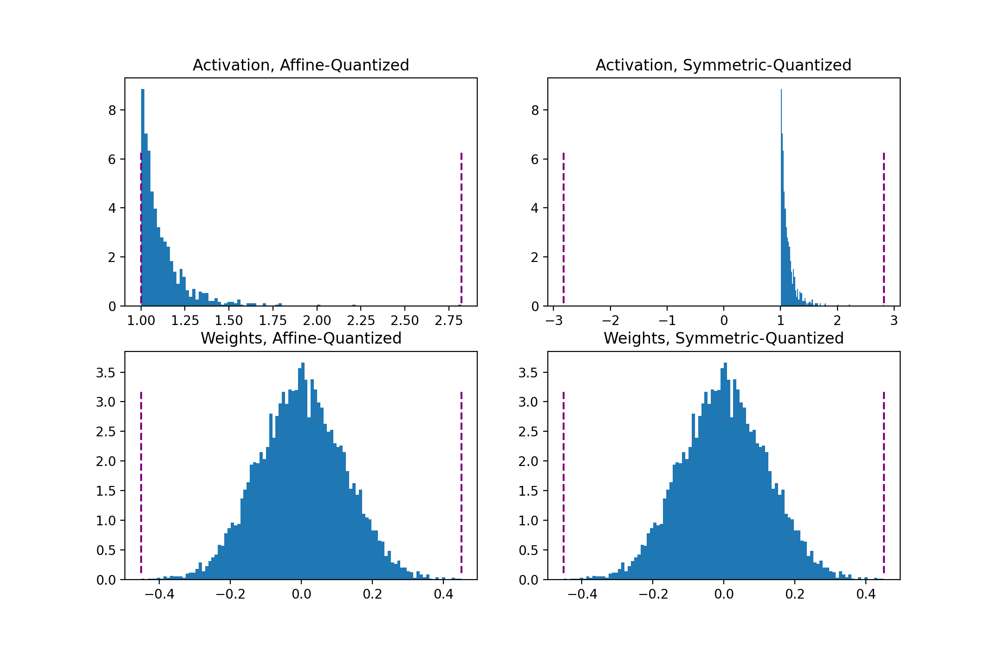
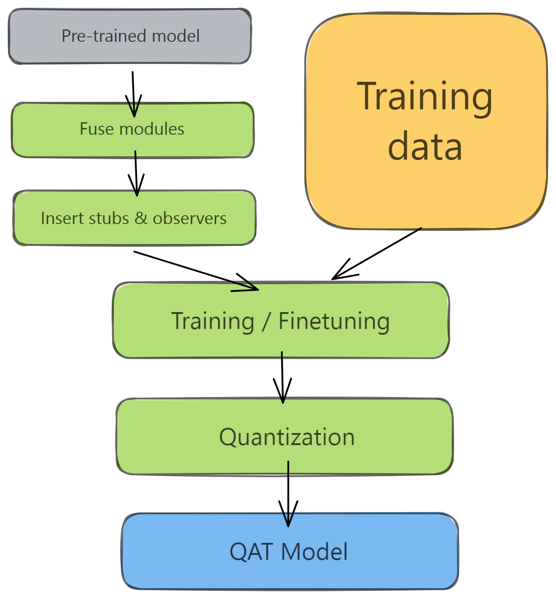
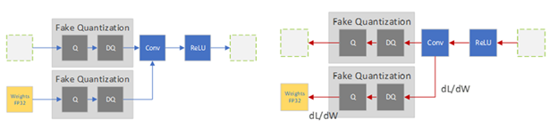
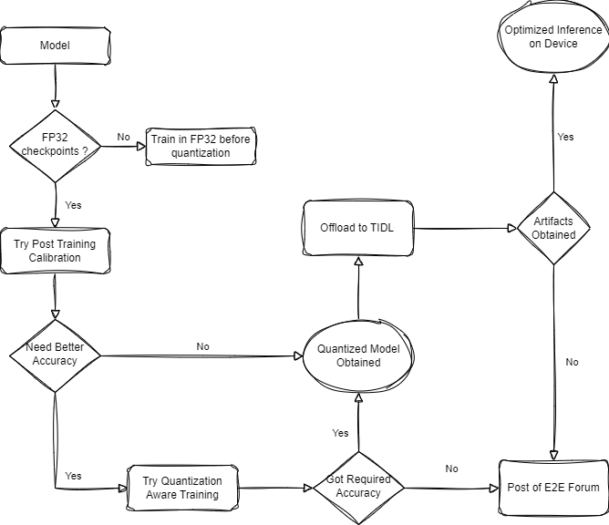

# Post Training Quantization and Quantization Aware Training using PyTorch FX Based API 

*PyTorch based Quantization for deployment in TI devices*

## Authors 
**Parakh Agarwal, Manu Mathew, Kunal Patel** <br>

*Processors, Embedded Processing, Texas Instruments*

## Introduction

Quantization is a cheap and easy way to make your DNN run faster and with lower memory requirements. We will lay a quick foundation of quantization in deep learning and how each technique looks in practice along with what pytorch offers as a part of quantization. Further, we explain our quantization wrapper which is build on top of original pytorch quantization and how it can be used to obtain quantized models. Finally we show the deployment of Quantized models in TI devices.

A lot of content in this tutorial/report has been borrowed from https://pytorch.org/blog/quantization-in-practice/. We thank them for such an informative blog.

### Fundamentals of Quantization

The quantization in deep learning aspect refer to reducing the numerical precision of weights and activations of the models to offer smaller models which can run with better efficiency. Further, multiple hardware vendors (such as TI itself) allows faster processing for 8-bit data (than 32-bit data) resulting in higher throughput. 

#### Mapping Function and Quantization Parameters

Mapping function maps the floating-point values to integer space. The most common mapping function is a linear transformation given by $Q(r) = round(r/S + Z)$, where r is the input and S, Z are the quantization parameters, scale factor and zero point which can be calculated as :

$$S = \frac{\beta - \alpha}{{\beta}_q - {\alpha}_q}   ;  Z = -(\frac{\alpha}{S} - \alpha_q)$$

where,
$[\alpha, \beta]$ is the clipping range of the input and $[\alpha_q, \beta_q]$ is the quantized range. For example, for 8-bit quantization, $\beta_q - \alpha_q <= (2^8 -1)$.

#### Affine and Symmetric Quantization Schemes

Symmetric quantization eliminates the need of having a zero-point offset by centering the input range around 0. The range thus is, $-\alpha = \beta = max(|max(r)|, |min(r)|)$. For activations, such as relu, this can result in bad quantization as the scale in this case would be double of how relu can be quantized. This type of quantization works very well in case of weight quantization. 

Assymetric quantization on the other hand assigns the input range to the min and max observed values. Thus the range is $\alpha = min(r), \beta = max(r)$. This is more computationally expensive if used in quantizing weights, however, it is necessary in quantizing activations.  

The below figure shows how the affine and symmetric quantization affects the weights and activations individually.  

<!--  -->


#### Per-Tensor and Per-Channel Quantization Schemes

Quantization parameters can be calculated for the layer’s entire weight tensor as a whole, or separately for each channel. In per-tensor, the same clipping range is applied to all the channels in a layer. Weights use per-channel quantization as it provides better accuracies, however, per-channel quantization in activations is not feasible to implement. 

<!--  -->


### Post Training Quantization / Calibration (PTQ/PTC)

PTC pre-quantizes the model weights and the clipping range for activations is also pre calibrated using the dataset. Thus activations stay in quantized precision between operations during inference. The models are quantized for a particular distribution and thus need to be re-calibrated to adjust for the distribution drift. The PTQ process can be explained by the following figure. 

<!--  -->


Module Fusion process combines sequential modules into one (eg: [Conv2d, BatchNorm, ReLU] to ConvBnReLU2d). This speeds up the kernel implementation along with reducing the quantization error. 

### Quantization Aware Training (QAT)

The PTC approach is fast and often great for most of the models however, few models suffer accuracy degradation in PTC, in that case, QAT is utilized, where, quantization loss is included in the training method which provides with an accurate INT8 model. This technique, however, requires training the network again for few epochs (suggested 10% of the original training schedule). The QAT process can be explained by the following figure. 

<!--  -->


All weights and biases are stored in FP32, and backpropagation happens as usual. However in the forward pass, quantization is internally simulated via FakeQuantize modules. They are called fake because they quantize and immediately dequantize the data, adding quantization noise similar to what might be encountered during quantized inference. The final loss thus accounts for any expected quantization errors. This helps in identifying  FP32 parameters such that quantizing them to INT8 does not significantly affect accuracy. Here is the forward and backward pass in case of QAT.

<!--  -->


The whole quantization workflow thus can be visualised as follows :

<!--  -->



## Pytorch Basic Quantization API

Pytorch provides API to introduce quantization in self defined networks, and we here would be give a breif on how they can be used for Post-Training Quantization and Quantization Aware Training. This will be utilizing the FX Based Pipeline.

### Post Training Quantization 

The model in Post-Training Quantization needs to be prepared, i.e., observers needs to be inserted along with the appropriate module fusion. Further, the observers calculate the min and max values across all parameters and activation. The calibration data should be from the same distribution as the dataset. Finally, the quantization parameters are calculated in the convert phase, where, finally the quantized model is obtained.

```
import torch
from torch import nn
from torch.quantization import quantize_fx
import copy

backend = "fbgemm"  # running on a x86 CPU. Use "qnnpack" if running on ARM.

model = nn.Sequential(
     nn.Conv2d(2,64,3),
     nn.ReLU(),
     nn.Conv2d(64, 128, 3),
     nn.ReLU()
)

m = copy.deepcopy(model)
m.eval()
qconfig_dict = {"": torch.quantization.get_default_qconfig(backend)}

# Prepare
model_prepared = quantize_fx.prepare_fx(m, qconfig_dict)

# Calibrate - Use representative (validation) data.
with torch.inference_mode():
  for _ in range(10):
    x = torch.rand(1,2,28, 28)
    model_prepared(x)

# quantize
model_quantized = quantize_fx.convert_fx(model_prepared)
```


### Quantization Aware Training

QAT follows the same steps as PTQ, with the exception of the training loop before you actually convert the model to its quantized version.
```
import torch
from torch import nn

backend = "fbgemm"  # running on a x86 CPU. Use "qnnpack" if running on ARM.

m = nn.Sequential(
     nn.Conv2d(2,64,8),
     nn.ReLU(),
     nn.Conv2d(64, 128, 8),
     nn.ReLU()
)

"""Fuse"""
torch.quantization.fuse_modules(m, ['0','1'], inplace=True) # fuse first Conv-ReLU pair
torch.quantization.fuse_modules(m, ['2','3'], inplace=True) # fuse second Conv-ReLU pair

"""Insert stubs"""
m = nn.Sequential(torch.quantization.QuantStub(), 
                  *m, 
                  torch.quantization.DeQuantStub())

"""Prepare"""
m.train()
m.qconfig = torch.quantization.get_default_qconfig(backend)
torch.quantization.prepare_qat(m, inplace=True)

"""Training Loop"""
n_epochs = 10
opt = torch.optim.SGD(m.parameters(), lr=0.1)
loss_fn = lambda out, tgt: torch.pow(tgt-out, 2).mean()
for epoch in range(n_epochs):
  x = torch.rand(10,2,24,24)
  out = m(x)
  loss = loss_fn(out, torch.rand_like(out))
  opt.zero_grad()
  loss.backward()
  opt.step()

"""Convert"""
m.eval()
torch.quantization.convert(m, inplace=True)
```

## TI Quantization Wrapper

The TI torch model optimization toolkit provides an easy way of incorporating quantization into the training framework, by just wrapping the original model inside a wrapper. The features of the quantization wrapper are as follows:
1. The model can itself be used further on as in the original framework. 
2. It provide optimizations such as bias calibration, outlier reduction in transformers, range shrink for CNNs and they can be utilized to ensure better quantized accuracy. 
3. Further, it provide the methods to export the onnx network, by registering custom symbolics. 
4. The toolkit also provides the option of experimenting with different qconfigs.
5. The toolkit ensures that the quantization parameter constraints required for execution on the mobile devices are applied.


### Quantization Configurations

The quantization toolkit provides the options for using different qconfigs. The user can also define their own qconfig similar to the ones defined below in the [qconfig file](../../../edgeai-modeloptimization/torchmodelopt/edgeai_torchmodelopt/xmodelopt/quantization/v2/qconfig_types.py). 

| QConfig | Explanation | 
| :---:| :--- | 
|WC8_AT8|per-channel quantization for weights, per-tensor quantization for activations| 
|MSA_WC8_AT8|WC8_AT8 + no range shrink (mostly for attention networks with important peaks)| 
|WT8SYMP2_AT8SYMP2|per-tensor symmetric power-of-2 scale for both weights and activations| 
|WC8SYMP2_AT8SYMP2|per-channel symmetric power-of-2 scale for weights, per-tensor symmetric power-of-2 scale for activations|
|WC8P2_AT8P2|per-channel symmetric power-of-2 quantization for weights, per-tensor affine power-of-2 for activations| 
|MSA_WC8P2_AT8P2|WC8P2_AT8P2 + no range shrink (mostly for attention networks with important peaks)| 


### Post Training Calibration / Quantization (PTC/PTQ) 

The model original training flow could be used for introducing quantization in the model using the the PTC quantization technique. The quantized model can be evaluated both before and after the conversion step. It is often slow to evaluate after the conversion. It is possible to evaluate before the conversion as the observers will be frozen after the num_observer_update_epochs number of epochs, which are evaluated by the model.train() calls. A bias calibration factor in the range of $(0.001, 0.01)$ is often used for best results. It is recommended to calibrate for at-least 100 images from the validation/training dataset.

```
import torch
import torch.nn as nn
import edgeai_torchmodelopt

# create your model here:
model = nn.Sequential(
     nn.Conv2d(3,64,8),
     nn.ReLU(),
     nn.Conv2d(64, 128, 8),
     nn.ReLU()
)

# load your pretrained checkpoint/weights (Float32) here to do PTC
pretrained_data = torch.load(pretrained_path)
model.load_state_dict(pretrained_data)

# wrap your model in xmodelopt.quantization.PTCFxModule 
# once it is wrapped, the actual model is in model.module
model = edgeai_torchmodelopt.xmodelopt.quantization.v2.PTCFxModule(model, backend='qnnpack', qconfig_type='WC8_AT8', bias_calibration_factor=0.01, num_batch_norm_update_epochs=1, num_observer_update_epochs=2)

## Note: if you want to test your model after PTC, loading of the PTC checkpoint/weights should be here into model.module
## pretrained_ptc_data = torch.load(pretrained_ptc_path)
## model.module.load_state_dict(pretrained_ptc_data)

# your training loop here without loss, backward, optimizer and scheduler. 
for ep_iter in range(3):
     model.train()
     for images, target in my_dataset_calibration:
          output = model(images)

model.eval()

# save the checkpoint/weights - the trained module is in model.module
torch.save(model.module.state_dict(), os.path.join(save_path,'model.pth'))

# convert the model to operate with integer operations (instead of QDQ FakeQuantize operations)
model = model.convert()

# create a dummy input - this is required for onnx export.
dummy_input = torch.rand((1,3,384,768))

# export the model to onnx format - the trained module is in model.module
model.export(dummy_input, os.path.join(save_path,'model.onnx'), opset_version=17)


Optional: Careful attention needs to be given to how the parameters of the pretrained model is loaded and trained model is saved as shown in the above code snippet. We have provided a utility function called edgeai_torchmodelopt.xnn.utils.load_weights() that prints which parameters are loaded correctly and which are not - you can use this load function if needed to ensure that your parameters are loaded correctly.
```

### Quantization Aware Training

The QAT approach could be used when the results from PTC are not satisfactory, and it is recommended to train for 10% of the epochs of original training regime. Often in our experiments, we were able to obtain good results on using around 10% of the training data and training for 25 epochs. Further, the learning rate should be around 1% of the learning rate used during float training. 

```
import torch
import torch.nn as nn
import edgeai_torchmodelopt

# create your model here:
model = nn.Sequential(
     nn.Conv2d(3,64,8),
     nn.ReLU(),
     nn.Conv2d(64, 128, 8),
     nn.ReLU()
)
# load your pretrained checkpoint/weights (Float32) here to do QAT
pretrained_data = torch.load(pretrained_path)
model.load_state_dict(pretrained_data)

# wrap your model in xnn.quantization.QATFxModule. 
# once it is wrapped, the actual model is in model.module
model = edgeai_torchmodelopt.xmodelopt.quantization.v2.QATFxModule(model, total_epochs=epochs)

## Note: if you want to test your model after QAT, loading of the QAT checkpoint/weights should be here into model.module
## pretrained_qat_data = torch.load(pretrained_qat_path)
## model.module.load_state_dict(pretrained_qat_data)

# your training loop here with with loss, backward, optimizer and scheduler. 
# this is the usual training loop - but use a lower learning rate such as 1e-5
for epoch in epochs:
     model.train()
     for images, target in my_dataset_train:
          output = model(images)
     # loss, backward(), optimizer step etc comes here as usual in training

model.eval()

# save the checkpoint/weights - the trained module is in model.module
torch.save(model.module.state_dict(), os.path.join(save_path,'model.pth'))

# convert the model to operate with integer operations (instead of QDQ FakeQuantize operations)
model = model.convert()

# create a dummy input - this is required for onnx export.
dummy_input = torch.rand((1,3,384,768))

# export the model to onnx format 
model.export(dummy_input, os.path.join(save_path,'model.onnx'), opset_version=17)

```


## Deployment in TI Devices

The quantized onnx networks can be directly used to be deployed in the mobile devices and the quantized parameters can be used directly from the model itself rather than having to perform calibration again. Two different ways could be used to offload the quantized network onto a TI device, the user can pick either based on their own convenience. 


### Using TIDL-Tools

Please set the following in the import config file of TIDL to use the provided calibration parameters: <br>
```
'advanced_options:prequantized_model' : 1 # Bypasses TIDL quantization
'accuracy_level': 0 
```

### Using Edge-AI Benchmark

The config for the model can be declared using the follows, which will enable using the pre calculated quantization parameters. The config for similar are available in [edgeai-benchmark configs](../../../edgeai-benchmark/configs). The file classification_v2.py has some examples for the quantized networks. 

```
quant_params_proto_path_disable_option = {constants.ADVANCED_OPTIONS_QUANT_FILE_KEY: ''}

# set the following as the runtime options while declaring the session. 
runtime_options=settings.runtime_options_onnx_qat_v2(**quant_params_proto_path_disable_option),
```

