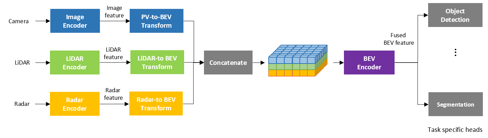
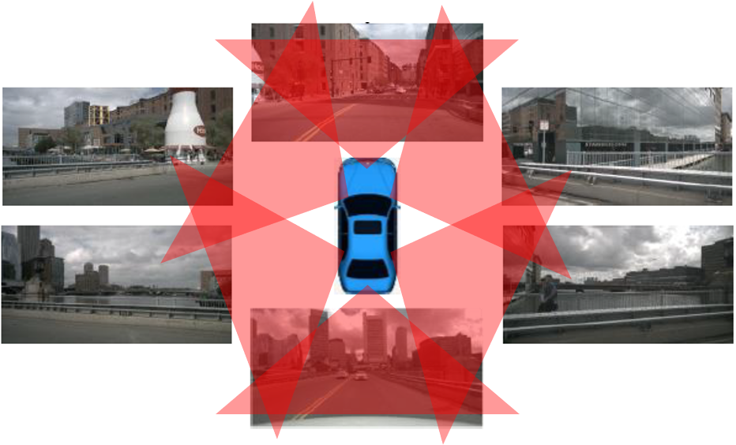
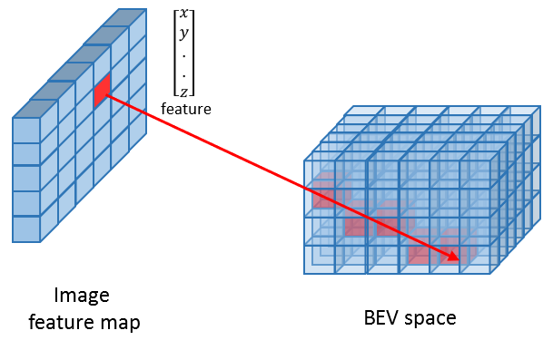
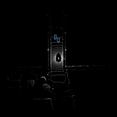
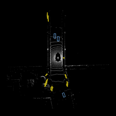
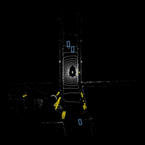
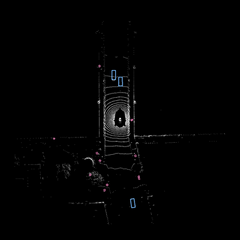
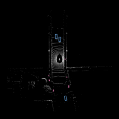

# Unified framework for bird's eye view 3D detection

*Development, training and optimization of bird's eye view 3D detection models for TI devices*

## Authors 
**Do-Kyoung Kwon, Kunal Patel, Parakh Agarwal and Manu Mathew** <br>

*Processors, Embedded Processing, Texas Instruments*

## Introduction

Bird's eye view (BEV) representation enables multiple sensor fusion without geometric distortion by registering them into a unified coordinate system on the ground. With rich information transformed to BEV from multiple sensors, detection algorithms can be applied in BEV independent of sensor types and configurations. For this reason, the 3D perception in BEV has been an effective approach to understand surroundings for advanced driver assistance system (ADAS) and autonomous vehicles.

<br>
<figure class="image">
  
  <figcaption> <br>Figure 1. Overall architecture of 3D percetion in BEV with multi-modal sensors</figcaption>
</figure>


Figure 1 shows am overall framework of 3D perception in BEV with camera, LiDAR and radar sensors. It first extracts feature maps by applying sensor specific encoders and transforms them to a unified BEV representation. The image feature in perspective view (PV) is transformed to BEV using camera's intrinsic parameter and extrinsic parameter with respect to the origin and orientation of BEV, i.e. BEV coordinate system (CS). Depth information is needed for every image feature in the PV-to-BEV transform, through which perspective distortion is being removed. LiDAR and radar features are also transformed to BEV coordinate system using the sensors' extrinsic parameters with respective to BEV CS. Note that LiDAR CS and radar CS are already in 3D space and LiDAR CS, radar CS or other position at a vehicle can be BEV CS. All sensor features in BEV are merged together by simple concatenation or other methods, to which BEV encoder is applied to extract fused BEV feature. Finally, task specific heads are applied for different tasks. Even though temporal fusion is not considered in Figure 1, BEV representation is also effective in dealing with sensor information from multiple temporal frames.

### Multi-camera bird's eye view 3D detection

Camera configuration for BEV 3D detection is shown in Figure 2, where six calibrated cameras are mounted on a vehicle to cover 360&deg; surrounding. Since BEV 3D detection with cameras only, i.e. without LiDAR and radar, is especially crucial in ADAS and autonomous driving because of low deployment cost, we focus on multi-camera BEV 3D detection. Depending on how the PV-to-BEV transform is performed, multi-camera BEV 3D detection can be classified into depth-based algorithm and query-based algorithm. Generally speaking, convolutional neural network (CNN) is employed for BEV encoder and detection in depth-based algorithms while transformer in query-based algorithms.

<br>
<figure class="image">
  
  <figcaption> <br>Figure 2. Camera configuration for mulit-camera BEV 3D detection</figcaption>
</figure>


Depth-based algorithms map the feature vector at every pixel in an image feature map directly to the corresponding 3D locations in BEV with depth guidance. The depth probability is predicted for every pixel using a simple network or simply assumed to be uniform at the cost of accuracy. As shown in Figure 3, the feature is transformed to BEV space according to camera's intrinsic and extrinsic parameters. All the voxels in BEV space, where a pixel ray passes through, are assigned the feature scaled by the corresponding depth probability. Since each voxel can be assigned multiple features from multiple cameras, the final feature for a voxel is computed by summing or averaging all the features being mapped to the voxel. Such a BEV pooling process on GPU is described in detail in [BEVPoolv2 [3]](https://arxiv.org/pdf/2211.17111). 

Depth-based algorithms include [BEVDet [1]](https://arxiv.org/abs/2112.11790) and [FastBEV [2]](https://arxiv.org/abs/2301.12511). Although they are built on the same architecture shown in Figure 1, there are a couple of key difference between them. [BEVDet [1]](https://arxiv.org/abs/2112.11790) performs BEV pooing with the predicted non-uniform depth probability for the view transform and does not use temporal information. On the contrary, [FastBEV [2]](https://arxiv.org/abs/2301.12511) assumes the uniform depth distribution and makes the view transform even simpler using the inverse mapping from BEV to PV. In this way, a voxel is assigned single feature from one of multiple feature maps and the view transformation process can run faster with the use of a mapping look-up table. Another difference is the use of temporal information. Three previous image feature maps are projected to the respective BEV space, aligned to the current BEV space using the vehicle's pose transformation between two timestamps, and then concatenated to the current BEV feature. 

<br>
<figure class="image">
  
  <figcaption> <br>Figure 3. Depth-based view transform </figcaption>
</figure>

Query-based algorithms performs the PV-to-BEV transform through the cross attention between image feature and BEV queries. [PETR [4]](https://arxiv.org/abs/2203.05625), [PETRv2 [5]](https://arxiv.org/abs/2206.01256) and [BEVFormer [6]](https://arxiv.org/abs/2203.17270) are in this category. [PETR [4]](https://arxiv.org/abs/2203.05625) produces the 3D position-aware features by adding the 3D position embeddings to 2D image feature. Then the sparse object queries are updated through the cross attention with the 3D position-aware features in transformer decoder. [PETRv2 [5]](https://arxiv.org/abs/2206.01256) is a straightforward extension of PETR to utilize the temporal information. Before adding the 3D position embeddings, the 2D image feature from the previous frame is aligned with and concatenated to the current image feature using the camera's pose transformation between two timestamps. [BEVFormer [6]](https://arxiv.org/abs/2203.17270) creates dense grid-shaped BEV queries, each of which corresponds to each grid cell in the BEV plane, and aggregates spatiotemporal features from multi-view and multi-timestamp cameras using temporal self attention (TSA) and spatial cross attention (SCA). In TSA, each BEV query interacts with the BEV features at different timestamp to extract temporal information by modeling the temporal connection. In SCA, each BEV query interacts with the image features in the regions of interest across cameras through deformable attention, through which the PV-to-BEV transform occurs. The deformable attention is adopted in both TSA and SCA.

## Unified framework for bird's eye view 3D detection: edgeai-mmdetection3d

Even though many of BEV 3D detection models have been built on top of [mmdetection3d](https://github.com/open-mmlab/mmdetection3d), they are based on different versions of [mmdetection3d](https://github.com/open-mmlab/mmdetection3d) and different versions of dependent packages such as [mmdetection3d](https://github.com/open-mmlab/mmdetection), [mmcv](https://github.com/open-mmlab/mmcv) and [mmengine](https://github.com/open-mmlab/mmengine). There are also BEV models not built on [mmdetection3d](https://github.com/open-mmlab/mmdetection3d) and some of them even use different formats of data files. Managing all the environments, code bases and data files for all BEV models is not recommended. Therefore, we have devloped the unified framework, [edgeai-mmdetection3d](https://github.com/TexasInstruments/edgeai-tensorlab/tree/main/edgeai-mmdetection3d), for the development, training and evaluation of various BEV 3D detection models. [edgeai-mmdetection3d](https://github.com/TexasInstruments/edgeai-tensorlab/tree/main/edgeai-mmdetection3d) is built on top of [mmdetection3d](https://github.com/open-mmlab/mmdetection3d) as well and it has the following features:

| Features | Explanation | 
| :--- | :--- | 
|Models supported| [BEVDet [1]](https://arxiv.org/abs/2112.11790), [FastBEV [2]](https://arxiv.org/abs/2301.12511) (Depth-based). <br> [PETR [4]](https://arxiv.org/abs/2203.05625), [PETRv2 [5]](https://arxiv.org/abs/2206.01256), [BEVFormer [6]](https://arxiv.org/abs/2203.17270) (Query-based). <br> [FCOS3D [7]](https://arxiv.org/abs/2104.10956)*. | 
|QAT| PT2E based QAT supported for [FastBEV [2]](https://arxiv.org/abs/2301.12511) and [FCOS3D [7]](https://arxiv.org/abs/2104.10956)*. <br> QAT for other models under development. | 
|Datasets supported| [nuScenes](https://www.nuscenes.org/), [Pandaset](https://github.com/scaleapi/pandaset-devkit) (under development).| 
|Data files| Pickle files created for training, validation and test dataset for all models. |

<sub> * [FCOS3D [7]](https://arxiv.org/abs/2104.10956) is a monocular 3D detection model, which detects 3D objects from surrounding multiple cameras independently. </sub>

In this section, we present how to install [edgeai-mmdetection3d](https://github.com/TexasInstruments/edgeai-tensorlab/tree/main/edgeai-mmdetection3d), prepare dataset, run training and inferencing along with the accuracies of the floating-point models trained by [edgeai-mmdetection3d](https://github.com/TexasInstruments/edgeai-tensorlab/tree/main/edgeai-mmdetection3d).

### Installation 

We recommend to install [edgeai-mmdetection3d](https://github.com/TexasInstruments/edgeai-tensorlab/tree/main/edgeai-mmdetection3d) and dependent packages in a Python 3.10 environment. Please refer to [Installation](https://github.com/TexasInstruments/edgeai-tensorlab/tree/main/edgeai-mmdetection3d#environment) for installation instructions.

### Dataset preparation

[nuScenes](https://www.nuscenes.org/) dataset is supported for the BEV 3D detection models. We provide here instructions to download and set up the dataset. Similar instructions can be found in [nuScenes dataset](https://mmdetection3d.readthedocs.io/en/latest/advanced_guides/datasets/nuscenes.html) and `nuScenes` database schema is available [here](https://www.nuscenes.org/nuscenes#data-format).

First, download nuScenes 3D detection `Full dataset (v1.0)` from [download page](https://www.nuscenes.org/download) and unzip all zip files. We have to download CAN bus expansion data as well and move it to data directory. It is recommended to symbolic link the dataset root to `edgeai-mmdetection3d/data`. The directory structure should be organized as follows after downloading the dataset.

```
edgeai-mmdetection3d
├── mmdet3d
├── tools
├── projects
├── data
│   ├── can_bus
│   ├── nuscenes
│   │   ├── maps
│   │   ├── samples
│   │   ├── sweeps
│   │   ├── v1.0-test
|   |   ├── v1.0-trainval
...
```
<br>

[edgeai-mmdetection3d](https://github.com/TexasInstruments/edgeai-tensorlab/tree/main/edgeai-mmdetection3d) requires the useful data information to be organized in `.pkl` files in a specific format. `.pkl` includes file paths to multi-camera images, corresponding intrinsic and extrinsic parameters, groundtruth detections, etc. for every timestamp. To prepare base information in `.pkl` files, run the following command:

```bash
python tools/create_data.py nuscenes --root-path ./data/nuscenes --out-dir ./data/nuscenes --extra-tag nuscenes --canbus ./data
```
<br>

This command creates dictionaries, `nuscenes_infos_train.pkl`, `nuscenes_infos_val.pkl` and '`nuscenes_infos_test.pkl` for training, validation and test datasets, respectively. These dictionaries contain two keys: `metainfo` and `data_list`. `metainfo` contains the basic information for the dataset itself while `data_list` is a list of dictionaries, each element of which is also a dictionary that contains all the detailed information of single sample, i.e. for single timestamp. For each sample, `data_list` includes the following keys:

- `sample_idx`: Index of this sample in the whole dataset.
- `token`: Sample data token.
- `timestamp`: Timestamp of the sample.
- `ego2global`: Transformation matrix from ego vehicle to the origin of global frame.
- `images`: Dictionary containing six keys corresponding to `CAM_FRONT`, `CAM_FRONT_RIGHT`, `CAM_FRONT_LEFT`, `CAM_BACK`, `CAM_BACK_LEFT` and `CAM_BACK_RIGHT`. Each of them contains the information related to the corresponding cameras: 
    - `img_path`: Filename (.jpg) of the image.
    - `cam2img`: Intrinsic camera parameter, which specifies the transformation when projecting 3D points to the image plane.
    - `cam2ego`: Transformation matrix from the camera to ego vehicle.
    - `lidar2cam`: Transformation matrix from LiDAR sensor to the camera.
    - `timestamp`: Timestamp of the image.
    - `sample_data_token`: Sample data token of the image.
- `lidar_points`: Dictionary containing all the information related to the LiDAR points for the LiDAR frames with annotation, which includes 
    - `lidar_path`: Filename (.bin) of the LiDAR point cloud.
    - `lidar2ego`: Transformation matrix from the LiDAR sensor to ego vehicle.
- `lidar_sweeps`: List containing sweep information, i.e. intermediate LiDAR frames without annotations.
- `instances`: List of dictionaries, each of which contains all annotation information of single instance. For the i-th instance, it has
    - `bbox_3d`: List of 7 numbers representing the 3D bounding box of the instance, (x, y z, l, w, h, yaw).
    - `bbox_label_3d`: Label of 3D bounding box.
    - `bbox_3d_isvalid`: Flag whether each bounding box is valid. A 3D bounding box is valid if it includes at least one lidar or radar point.
    - `velocity`: Velocities of 3D bounding boxes, (vx, vy).
    - `num_lidar_pts`: Number of LiDAR points included in each 3D bounding box.
    - `num_radar_pts`: Number of radar points included in each 3D bounding box.
- `cam_instances`: Dictionary containing six keys corresponding to `CAM_FRONT`, `CAM_FRONT_RIGHT`, `CAM_FRONT_LEFT`, `CAM_BACK`, `CAM_BACK_LEFT` and `CAM_BACK_RIGHT`, which are 3D bounding box annotations of the whole scene split into the corresponding cameras they belong to. For the i-th instance of each camera, it has
    - `bbox_label`: Label of bounding box.
    - `bbox_label_3d`: Label of 3D bounding box.
    - `bbox`: 2D bounding box project on the image, (x1, y1, x2, y2).
    - `bbox_3d`: List of 7 numbers representing the 3D bounding box of the instance, (x,y z, l, w, h, yaw).
    - `center_2d`: Projected center location on the image.
    - `depth`: Depth of the projected center.
    - `velocity`: Velocities of 3D bounding boxes, (vx, vy).
    - `attr_label`: Attribute label of the instance.
- `can_bus`: Additional information about ego vehicle's pose, velocity, acceleration, etc. 18x1 array with
    - `pose`: [0:3] Position (x, y, z) in meters in the global frame.
    - `orientation`: [3:7] Rotation vector in the ego vehicle frame.
    - `accel`: [7:10] Acceleration vector in the ego vehicle frame in m/s/s.
    - `rotation rate`: [10:13] Angular velocity vector of the ego vehicle, in the ego vehicle frame in rad/s.
    - `vel`: [13:16] Velocity in m/s in the ego vehicle frame.
    - `zeros`: [16:18] Zero vectors.
- `scene_token`: Scene token where the sample belong to.
- `prev`: Token of the next sample data
- `next`: Token of the previous sample data

This information are enough for [PETR [4]](https://arxiv.org/abs/2203.05625), [BEVFormer [6]](https://arxiv.org/abs/2203.17270) and [FCOS3D [7]](https://arxiv.org/abs/2104.10956). But other models need more information such as additional annotation or camera sweeps. To include additional data fields for [BEVDet [1]](https://arxiv.org/abs/2112.11790) and [PETRv2 [5]](https://arxiv.org/abs/2206.01256), we should add `--bevdet` and `--petrv2`, respectively, to the command. For example,

```bash
python tools/create_data.py nuscenes --root-path ./data/nuscenes --out-dir ./data/nuscenes --extra-tag nuscenes --canbus ./data --bevdet --petrv2
```

Moreover, [FastBEV [2]](https://arxiv.org/abs/2301.12511) make use of multiple previous samples up to 3 and therefore need to pack neighboring samples' information as well in a `.pkl` file for training. For this purpose, we should run the following script, which will create `nuscenes_infos_train_fastbev.pkl` from `nuscenes_infos_train.pkl`.

```bash
python tools/dataset_converters/generate_fastbev_sweep_pkl.py --root-path ./data/nuscenes --version 'v1.0-trainval'
```
<br>

The directory after creating pickle files should look like

```
edgeai-mmdetection3d
├── mmdet3d
├── tools
├── projects
├── data
│   ├── can_bus
│   ├── nuscenes
│   │   ├── maps
│   │   ├── samples
│   │   ├── sweeps
│   │   ├── v1.0-test
|   |   ├── v1.0-trainval
│   │   ├── nuscenes_gt_database
│   │   ├── nuscenes_infos_train.pkl
│   │   ├── nuscenes_infos_train_fastbev.pkl
│   │   ├── nuscenes_infos_val.pkl
│   │   ├── nuscenes_infos_test.pkl
│   │   ├── nuscenes_dbinfos_train.pkl
...
```
<br>

### Bird's eye view 3D detection models

The BEV 3D detection models integrated into [edgeai-mmdetection3d](https://github.com/TexasInstruments/edgeai-tensorlab/tree/main/edgeai-mmdetection3d) are located in `edgeai-mmdetection3d/projects` as shown below. Under each model directory (e.g. `BEVDet`), `configs` has model configuration files and the model directory in small case (e.g. `bevdet`) has python scripts that define networks, dataset loader, pre-processing, post-processing, etc., most of which are inherited from the classes defined in `edgeai-mmdetection3d/mmdet3d`.

```
edgeai-mmdetection3d
├── mmdet3d
├── tools
├── projects
|   ├── BEVDet
|   │   ├── bevdet
|   │   ├── configs
|   │   └── README.md
|   ├── BEVFormer
|   │   ├── bevformer
|   │   ├── configs
|   │   └── README.md
|   ├── FastBEV
|   │   ├── configs
|   │   ├── fastbev
|   │   └── README.md
...
```

The table below is a brief summary of the model configurations we have trained and evaluated using [edgeai-mmdetection3d](https://github.com/TexasInstruments/edgeai-tensorlab/tree/main/edgeai-mmdetection3d).

| Models            | Configs              | Explanation |
| :---              | :---                 | :---        |
| [BEVDet [1]](https://arxiv.org/abs/2112.11790)   | bevdet-r50 | ResNet-50 image backbone + FPN with 6x3x256x704 input tensor. <br> View transform with non-uniform depth probability. <br> ResNet based BEV encoder + FPN. |
| [FastBEV [2]](https://arxiv.org/abs/2301.12511) | fastbev_r18_f1 | ResNet-18 image backbone + FPN with 6x3x256x704 input tensor. <br> Simplified view transform with uniform depth probability. <br> ResNet based BEV encoder. | 
| [FastBEV [2]](https://arxiv.org/abs/2301.12511) | fastbev_r34_f4 | ResNet-34 image backbone + FPN with 6x3x256x704 input tensor. <br> Simplified view transform with uniform depth probability. <br> ResNet based BEV encoder. <br> Use of three previous temporal samples. |
| [PETR [4]](https://arxiv.org/abs/2203.05625) | petr_vovnet | VoVNet image backbone with + FPN 6x3x320x800 input tensor. <br> Six layers of the transformer decoder with multi-head self attention (MHSA) and multi-head cross attention (MHCA). |
| [PETRv2 [5]](https://arxiv.org/abs/2206.01256) | petrv2_vovnet | Same features as in [PETR [4]](https://arxiv.org/abs/2203.05625). <br> Use of a previous temporal sample. |
| [BEVFormer [6]](https://arxiv.org/abs/2203.17270)  | bevformer_tiny | ResNet-50 image backbone + FPN with 6x3x480x800 input tensor. <br> Three layers of the transformer encoder with TSA and SCA based on deformable attention. <br> Six layers of the transformer decoder with MHSA and CA based on deformable attention. |
| [FCOS3D [7]](https://arxiv.org/abs/2104.10956) | fcos3d_r101_dcn | ResNet-101 image backbone + FPN with 1x3x928x1600 input tensor <br> Deformable convolution in ResNet-101 and detection heads |

### Model training and inference

The models were trained the models with [nuScenes](https://www.nuscenes.org/) training dataset and evaluated with validation dataset. For floating-point model training, move to the `edgeai-mmdetecion3d` directory and run the following command: 

```
./tools/dist_train.sh path/to/model/config <num_gpus>
```
For example, to train the BEVDet model with 4 GPUs

```
./tools/dist_train.sh projects/BEVDet/configs/bevdet-r50.py 4
```

To evaluate the trained floating-point model, run the following command in the same directory:
```
python ./tools/test.py path/to/model/config <latest.pth file after training>
```
For example, to evaluate the BEVDet model,
```
python ./tools/test.py projects/BEVDet/configs/bevdet-r50.py ./work_dirs/bevdet-r50/epoch_24.pth
```
Note that it is for single GPU. `./tools/dist_test.sh` can be used for multiple GPU evaluation process as well.

The accuracies of the floating-point models trained using [edgeai-mmdetection3d](https://github.com/TexasInstruments/edgeai-tensorlab/tree/main/edgeai-mmdetection3d) are shown in the table below for [nuScenes](https://www.nuscenes.org/) validation dataset (total 6019 samples). For comparison, the accuracies of the pre-trained models provided by the original git repos are shown as well. [FCOS3D [7]](https://arxiv.org/abs/2104.10956) hasn't been trained yet, which is going to be available soon.

| Models    | Configs         | edgeai-mmdetection3d        | Original Repo.               | 
| :---      | :---            | :---:                       | :---:                        |
| BEVDet    | bevdet-r50      | mAP: 0.2845 <br>NDS: 0.3501 | mAP: 0.2845 <br> NDS: 0.3501 | 
| FastBEV   | fastbev_r18_f1  | mAP: 0.2491 <br>NDS: 0.3426 | mAP: 0.2430 <br><br>         |
| FastBEV	  | fastbev_r34_f4  | mAP: 0.3471 <br>NDS: 0.4765 | mAP: 0.3260 <br> NDS: 0.4550 |
| PETR      | petr_vovnet     | mAP: 0.3837 <br>NDS: 0.4288 | mAP: 0.3780 <br> NDS: 0.4260 |
| PETRv2    | petrv2_vovnet   | mAP: 0.3794 <br>NDS: 0.4640 | mAP: 0.4100 <br> NDS: 0.5030 |
| BEVFormer | bevformer_tiny  | mAP: 0.2684 <br>NDS: 0.3709 | mAP: 0.3540 <br> NDS: 0.2520 |
| FCOS3D    | fcos3d_r101_dcn | N/A                         | mAP: 0.2979 <br> NDS: 0.3773 |


## Bird's eye view 3D model compile: edgeai-benchmark

After training, we can export the ONNX models while inferencing from [edgeai-mmdetection3d](https://github.com/TexasInstruments/edgeai-tensorlab/tree/main/edgeai-mmdetection3d) by setting `save_onnx_model=True` for the `model` definition in a config file. For example, to export the ONNX model for BEVDet, `bevdet-r50.py` should look like:

```bash
model = dict(
    type='BEVDet',
    save_onnx_model=True,
    data_preprocessor=dict(
        type='Det3DDataPreprocessor',
        mean=[123.675,  116.280, 103.530],
        std=[58.395, 57.120, 57.375],
        ...
```

The exported ONNX models can be compiled by [edgeai-benchmark](https://bitbucket.itg.ti.com/projects/EDGEAI-ALGO/repos/edgeai-benchmark/browse?at=refs%2Fheads%2F2024%2Fdokyoung_bev) to quantize and convert the models into a format that can be inferred with TIDL. TIDL and its open source front ends such as `ONNXRuntime` provides utilities to compile models. The artifacts created as the compiling outputs can be imported into TI devices to run inference. 

For the BEV 3D detection models, [edgeai-benchmark](https://bitbucket.itg.ti.com/projects/EDGEAI-ALGO/repos/edgeai-benchmark/browse?at=refs%2Fheads%2F2024%2Fdokyoung_bev) also provides high-level utilities including dataset loaders, multi-camera pre-processing, post-processing, metric computation and 3D detection visualization on images and LiDAR views. To validate the exported ONNX models, we simply run the floating-point models through `ONNXRuntime` without delegation to TIDL. This process also validates the implemented dataset loaders, pre-processing, post-processing and metric computation. The table below shows the BEV 3D ONNX model accuracies in [edgeai-benchmark](https://bitbucket.itg.ti.com/projects/EDGEAI-ALGO/repos/edgeai-benchmark/browse?at=refs%2Fheads%2F2024%2Fdokyoung_bev) for [nuScenes](https://www.nuscenes.org/) mini validation dataset (total 81 samples). The accuracies of the PyTorch models in [edgeai-mmdetection3d](https://github.com/TexasInstruments/edgeai-tensorlab/tree/main/edgeai-mmdetection3d) are also shown for comparison. We can see that both are comparable. Since pre-processing and post-processing, e.g. non-maximum suppression (NMS) are slightly different in [edgeai-benchmark](https://bitbucket.itg.ti.com/projects/EDGEAI-ALGO/repos/edgeai-benchmark/browse?at=refs%2Fheads%2F2024%2Fdokyoung_bev) and [edgeai-mmdetection3d](https://github.com/TexasInstruments/edgeai-tensorlab/tree/main/edgeai-mmdetection3d), they are not exactly the same.


| Models     | Config          | edgeai-benchmark            | edgeai-mmdetection3d        |
| :---       | :---            | :---:                       | :---:                       |
| BEVDet     | bevdet-r50      | mAP: 0.2792 <br>NDS: 0.3098 | mAP: 0.2768 <br>NDS: 0.3143 |
| FastBEV    | fastbev_r18_f1  | mAP: 0.2382 <br>NDS: 0.3125 | mAP: 0.2406 <br>NDS: 0.3160 |
| FastBEV	   | fastbev_r34_f4  | mAP: 0.3192 <br>NDS: 0.3904 | mAP: 0.3205 <br>NDS: 0.3985 |
| PETR       | petr_vovnet     | mAP: 0.3610 <br>NDS: 0.3573 | mAP: 0.3542 <br>NDS: 0.3577 |
| BEVFormer  | bevformer_tiny  | mAP: 0.2660 <br>NDS: 0.3286 | mAP: 0.2668 <br>NDS: 0.3294 |
| FCOS3D     | fcos3d_r101_dcn | mAP: 0.2704 <br>NDS: 0.3117 | mAP: 0.2943 <br>NDS: 0.3216 |

The 3D detections visualized in BEV with LiDAR data are shown below.

| BEVDet (bevdet-r50) | FastBEV (fastbev_r18_f1) | FastBEV (fastbev_r34_f4) | 
|:-------------------:|:------------------------:| :-----------------------:| 
| [](./assets/bevdet_detection.mp4) | [](./assets/fastbev_f1_detection.mp4) | [](./assets/fastbev_f4_detection.mp4) </video> |

| PETR (petr_vovnet)  | BEVFormer (bevformer_tiny) |
|:-------------------:|:--------------------------:|
| [](./assets/petrv1_detection.mp4) | [](./assets/bevformer_detection.mp4) |


## Ongoing and future works

We continue to improve [edgeai-mmdetection3d](https://github.com/TexasInstruments/edgeai-tensorlab/tree/main/edgeai-mmdetection3d). To be specific, we are working to

- Support [Pandaset](https://github.com/scaleapi/pandaset-devkit) dataset and release the trained 3D BEV detection models in TI model zoo.  
- Support PT2E based QAT for all BEV 3D detection models.
- Support more BEV models such as [StreamPETR [8]](https://arxiv.org/abs/2303.11926) and [Far3D [9]](https://arxiv.org/abs/2308.09616) that provide more accurate and robust detection results.

We are also compiling the BEV 3D detection models through 8-bit, 16-bit and mixed-bit quantization with TIDL. The accuracies of the quantized models and the performances on TI devices will be available.


## References

[1] BEVDet: High-performance multi-camera 3D object detection in Bird-Eye-View, J. Huang, G. Huang, Z. Zhu, Y. ye, D. Du, https://arxiv.org/abs/2112.11790 <br>
[2] Fast-BEV: A fast and strong Bird's-Eye View perception baseline, Y. Li, B. Huang, Z. Chen, Y. Cui, F. Liang, M. shen, F. Liu, E. Xie, L.Sheng, W. Ouyang and J. Shao, https://arxiv.org/abs/2301.12511 <br>
[3] BEVPoolv2: A cuting-edge implementation of BEVDet toward deployment, J. Huang, G. Huang, https://arxiv.org/pdf/2211.17111 <br> 
[4] PETR: Position embedding transformation for multi-view 3D object detection, Y. Liu, T. Wang, X. Zhang, J. Sun, https://arxiv.org/abs/2203.05625 <br>
[5] PETRv2: A unified framework for 3D perception from multi-Camera images, Y. Liu, J. Yan, F. Jia, S. Li, A. Gao, T. Wang, X. Zhang, J. Sun, https://arxiv.org/abs/2206.01256 <br>
[6] BEVFormer: Learning Bird’s-Eye-View representation from multi-camera images via spatiotemporal transformers, Z. Li, W. Wang, H. Li, E. Xie, C. Sima, T. Lu, Q. Yu, J. Dai, https://arxiv.org/abs/2203.17270 <br>
[7] FCOS3D: Fully convolutional one-stage monocular 3D object detection, T. Want, X. Zhu, J. Pang and D. Lin, https://arxiv.org/abs/2104.10956 <br>
[8] Exploring object-centric temporal modeling for efficient multi-View 3D object detection, S. Wang, Y. Liu, T. Wang, Y. Li and X. Zhang, https://arxiv.org/abs/2303.11926 <br>
[9] Far3D: Expanding the horizon for surround-view 3D object detection, X. Jiang, S. Li, Y. Liu, S. Wang, F. Jia, T. Want, L. Han and X. Zhang, https://arxiv.org/abs/2308.09616 

