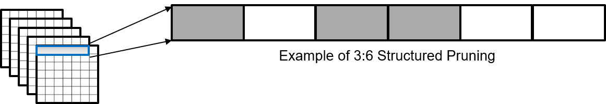
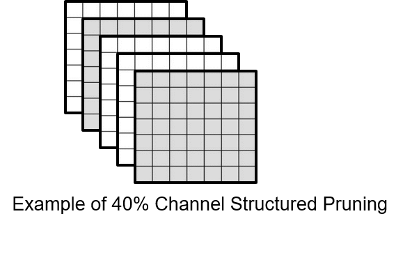

# Introduction

Deep Neural Networks (DNN) are used for a variety of Computer Vision tasks such as object detection, image segmentation, Image classification, etc. Other sensors such as LiDAR, Radar etc. are also being used with Neural Networks for applications such as Machine Vision, Industrial Inspection, Advanced Driver Assistance, Autonomous Driving etc. 

Embedded SoCs are designed to operate under constrained environments and typically they have limited amount of memory and computation throughput compared to Cloud based inference platforms. 

The DNNs usually have redundant weights and making those redundant weights, 0, is known as pruning which help reduce the complexity. Pruning could be structured as well as unstructured which is basically is whether is a particular pattern to prune the weights or not. 

Unstructured pruning is thus, we are making the weights 0 without any predefined pattern, whereas in structured pruning, we have a specific pattern in mind, on the basis os which pruning is carried out. We will be discussing two structured pruning approaches over here.

1. N:M Structured Pruning

    

    This approach would reduce the number of parameters and further the latency. Both the streaming ]engine as well as the inference engine can take advantage of this pruning approach. The example is for 3:6 pruning, it can be easily extended to any N:M pruning. 

2. Channel Structured Pruning

    

    This effectively reduces the computations as those channels could be removed from the layer. With these considerations, we can get a smaller network, which is parametrically as well as computationally efficient.

# APIs

## Basic Usage

Pruner wrapper can be directly wrapped around your model while training, which allows you to introduce pruning.

    from edgeai_torchmodelopt import xmodelopt
    model = xmodelopt.pruning.PrunerModule(model, pruning_ratio=args.pruning_ratio, total_epochs=args.epochs, 
                            pruning_init_train_ep = args.pruning_init_train_ep, pruning_class=args.pruning_class, 
                            pruning_type=args.pruning_type, pruning_global=args.pruning_global, pruning_m=args.pruning_m)

Here, we need to specify : 

-  pruning_ratio - the ratio of total weights that need to be pruned the end of training process. For example, a pruning ratio of 0.3 would mean, incase of 
    - channel sparsity that, 30 % of the total channels are getting pruned
    - n2m pruning that, for every 10 consecutive weights, 3 weights are getting pruned
-  total_epochs - total number of training epochs

We can also specify the following, depepnding on the use case :

- pruning_init_train_ep - the number of epochs that need to be trained before weights start to get pruned (Default: 5)
- pruning_class - the pruning class to be used (Options : 'blend' (default), 'sigmoid', 'incremental'). However, only blend class has been tested. The user can make their own pruning class as well from these modules
- pruning_type - the type of pruning that we want to incorporate in the network. The options are :
    - channel : This is the default option, where complete channels of the original network are pruned 
    - n2m : Here, of m consecutive weights, n weights gets pruned, however the pruning ratio should be specified in decimal itself and **the value of 'm' should also be passed**. 
    - prunechannelunstructured : Here, the pruning ratio is maintained for each layers of the network, however, within the layer, there is no structure
    - unstructured : This is unstructured pruning across the whole model
- pruning_global - whether we want to prune each layer with a different pruning ratio, depending on the spread of weights (Default: False)
- pruning_m - the value of "m" in case of n:m pruning. This needs to be provided along with the pruning ratio.

> This could be incorporated in the training script itself, and model thereafter could be trained as it was getting trained before to achieve the desired sparsity

## Channel Pruned Network

After the channel pruning, we can obtain a smaller network as well to test, which will give FLOP reductions irrespective of the hardware implementation. For example, for a layer with 64 output channels, and pruning ratio of 0.25, would have 48 output channels in the final_model..

    from edgeai_torchmodelopt.xmodelopt.pruning import create_channel_pruned_model

    ***
    load model here and checkpoints here
    ***

    final_model = create_channel_pruned_model(model)

    // the final_model would not have pruned channels

<!-- ## Advanced Usage 

### Declaring own Parametrization / Pruning Class 

We can make our own parametrization class, which lets one to directly use the toolkit for own pruning algorithm. Here, we will guide through our parametrization class 

### Specifying own pruning type -->

