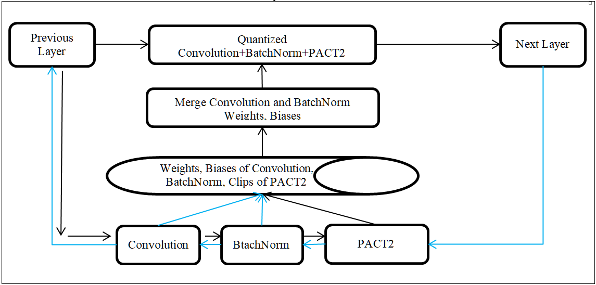
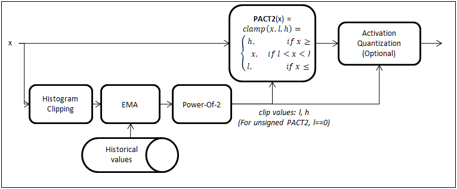

## Quantization Aware Training (QAT)
QAT is needed only if the accuracy obtained with PTQ is not satisfactory.

QAT is easy to incorporate into an existing PyTorch training code. We provide a wrapper module called QuantTrainModule to automate all the tasks required for QAT. The user simply needs to wrap his model in QuantTrainModule and do the training.

The overall flow of training is as follows:<br>
- Step 1:Train your model in floating point as usual.<br>
- Step 2: Starting from the floating point model as pretrained weights, do Quantization Aware Training. In order to do this wrap your model in the wrapper module called  edgeai_torchmodelopt.xmodelopt.quantization.v1.QuantTrainModule and perform training with a small learning rate. About 25 to 50 epochs of training may be required to get the best accuracy.<br>

QuantTrainModule does the following operations to the model. Note that QuantTrainModule that will handle these tasks - the only thing that is required is to wrap the user's module in QuantTrainModule as explained in the section "How to use  QuantTrainModule".<br>
- Replace all the ReLU, ReLU6 layers in the model by PACT2. Insert PACT2 after Convolution+BatchNorm if a ReLU/ReLU6 is missing after that.  Insert PACT2 anywhere else required - where activation range clipping and range collection is required. For example it can be after the Fully Connected Layer. We use forward post hooks of PyTorch nn.Modules to call these extra activation functions. Thus we are able to add these extra activations without disturbing the loading of existing pre-trained weights.<br>
- Clip the weights to an appropriate range if the weight range is very high.<br>
- Quantize the weights during the forward pass. Merging Convolution layers with the adjacent Batch Normalization layers (on-the-fly) during the weight quantization is required - if this merging is not correctly done, Quantization Aware Training may not improve accuracy.<br>
- Quantize activations during the forward pass.<br>
- Other modifications to help the learning process. For example, we use Straight-Through Estimation (STE) [[2,3]] to improve the gradient flow in back-propagation.<br>

A block diagram of Quantization Aware Training with QuantTrainModule is shown below:
<p float="left">  </p>


#### PACT2 activation
In order to make the activations quantization friendly, it is important to clip them during Quantization Aware Training. PACT2 activation module has been developed to clip the activations to a power-of-two value. PACT2 is used in the place of commonly used activation functions such as ReLU or ReLU6. Our Quantization Aware Training modules/scripts will automatically insert PACT2 activation functions wherever necessary to constraint the ranges of activations. The following is a block diagram of the PACT2:
<p float="left">  </p>
We use statistical range clipping in PACT2 to improve the Quantized Accuracy (compared to simple min-max range clipping).


#### What happens during Quantization Aware Training?
For each iteration perform a forward in floating point using the original weights and biases. During this pass PACT2 layers will collect output ranges using histogram and running average.

In addition, perform Convolution+BatchNorm merging and quantization of the resulting weights. These quantized and de-quantized weights are used in a forward pass. Ranges collected by PACT2 is used for activation quantization (and de-quantization) to generate quantized output.

Back-propagation with STE will update the parameters of the model to reduce the loss with quantization.

Within a few epochs, we should get reasonable quantization accuracy.


#### How to use  QuantTrainModule
In order to enable quantized training, we have developed the wrapper class edgeai_torchmodelopt.v1.xnn.quantization.QuantTrainModule. A simple example for using this module is given in the script [examples/quantization_example.py](../../examples/quantization_example.py) and calling this is demonstrated in [run_quantization_example.sh](../../run_quantization_example.sh). The usage of this module can also be seen in train_classification.py and train_pixel2pixel.py in [references/edgeailite/engine](../../references/edgeailite/engine). The following is a brief description of how to use this wrapper module:
```
from edgeai_torchmodelopt.v1 import xnn

# create your model here:
model = ...

# load your pretrained checkpoint/weights here to do QAT
pretrained_data = torch.load(pretrained_path)
model.load_state_dict(pretrained_data)

# create a dummy input - this is required to analyze the model - fill in the input image size expected by your model.
dummy_input = torch.rand((1,3,384,768))

# wrap your model in xnn.quantization.QuantTrainModule. 
# once it is wrapped, the actual model is in model.module
model = edgeai_torchmodelopt.xmodelopt.quantization.v1.QuantTrainModule(model, dummy_input=dummy_input, total_epochs=total_epochs)

## Note: if you want to test your model after QAT, loading of the QAT checkpoint/weights should be here into model.module
## pretrained_qat_data = torch.load(pretrained_qat_path)
## model.module.load_state_dict(pretrained_qat_data)

# your training loop here with with loss, backward, optimizer and scheduler. 
# this is the usual training loop - but use a lower learning rate such as 1e-5
model.train()
for images, target in my_dataset_train:
    output = model(images)
    # loss, backward(), optimizer step etc comes here as usual in training

model.eval()

# save the checkpoint/weights
torch.save(model.module.state_dict(), os.path.join(save_path,'model.pth'))

# export the model to onnx format - the trained module is in model.module
# QAT model can export a clean onnx graph with clips in eval mode.
torch.onnx.export(model.module, dummy_input, os.path.join(save_path,'model.onnx'), export_params=True, verbose=False, do_constant_folding=True, opset_version=11)
```

As can be seen, it is easy to incorporate QuantTrainModule in your existing training code as the only thing required is to wrap your original model in QuantTrainModule. Careful attention needs to be given to how the parameters of the pretrained model is loaded and trained model is saved as shown in the above code snippet.

Optional: We have provided a utility function called torchvision.edgeailite.xnn.utils.load_weights() that prints which parameters are loaded correctly and which are not - you can use this load function if needed to ensure that your parameters are loaded correctly.


### Implementation Notes, Recommendations & Limitations for QAT
**Please read carefully** - closely following these recommendations can save hours or days of debug related to quantization accuracy issues.

**The same module should not be re-used multiple times within the module** in order that the feature map range estimation is correct. Unfortunately, in the torchvision ResNet models, the ReLU module in the BasicBlock and BottleneckBlock are re-used multiple times. We have corrected this by defining separate ReLU modules. This change is minor and **does not** affect the loading of existing pretrained weights. See the [our modified ResNet model definition here](../../torchvision/models/resnet.py).<br>

**Use Modules instead of functionals or tensor operations** (by Module we mean classes derived from torch.nn.Module). We make use of Modules heavily in our quantization tools - in order to do range collection, in order to merge Convolution/BatchNorm/ReLU in order to decide whether to quantize a certain tensor and so on. For example use torch.nn.ReLU instead of torch.nn.functional.relu(), torch.nn.AdaptiveAvgPool2d() instead of torch.nn.functional.adaptive_avg_pool2d(), torch.nn.Flatten() instead of torch.nn.functional.flatten() etc.<br>

Other notable modules provided are: [xnn.layers.AddBlock](../../torchvision/edgeailite/xnn/layers/common_blocks.py) to do elementwise addition and [xnn.layers.CatBlock](../../torchvision/edgeailite/xnn/layers/common_blocks.py) to do concatenation of tensors. Use these in the models instead of tensor operations. Note that if there are multiple element wise additions in a model, each of them should use a different instance of xnn.layers.AddBlock (since the same module should not be re-used multiple times - see above). The same restriction applies for xnn.layers.CatBlock or any other module as well.

**Interpolation/Upsample/Resize** has been tricky in PyTorch in the sense that the ONNX graph generated used to be unnecessarily complicated. Recent versions of PyTorch has fixed it - but the right options must be used to get the clean graph. We have provided a functional form as well as a module form of this operator with the capability to export a clean ONNX graph [xnn.layers.resize_with, xnn.layers.ResizeWith](../../torchvision/xnn/layers/resize_blocks.py)

If you have done QAT and is getting poor accuracy either in the Python code or during inference in the platform, please inspect your model carefully to see if the above recommendations have been followed - some of these can be easily missed by oversight - and can result in painful debugging that could have been avoided.<br>

However, if a function does not change the range of feature map, it is not critical to use it in Module form. An example of this is torch.nn.functional.interpolate<br>

**Multi-GPU training/validation** with DataParallel or DistributedDataParallel is supported with our QAT modules, QuantTrainModule and QuantTestModule.<br>

If your training crashes because of insufficient GPU memory, reduce the batch size and try again.

It is seen to be beneficial (for higher accuracy) to freeze the BatchNorm and Quantization ranges after a few epochs during QAT. The utility functions xnn.utils.freeze_bn(model) and xnn.layers.freeze_quant_range(model) can be used for this. See example usage of these functions [here](../../references/edgeailite/scripts/quantize_classification_example.py)


### Compilation of QAT Models in TIDL

#### Instructions for compiling models in TIDL (until TIDL version 2.0)
If you are using TIDL to infer a model trained using QAT tools provided in this repository, please set the following in the import config file of TIDL for best accuracy: <br>
```
quantizationStyle = 3  #to use power of 2 quantization.
calibrationOption = 0  #to avoid further Calibration in TIDL.
```

#### Updated instructions for compiling models in TIDL 8.0 (August 2021) onwards:
From TIDL 8.0 onwards, the right calibrationOption is 64 for QAT models:
```
quantizationStyle = 3  #to use power of 2 quantization.
calibrationOption = 64 #to avoid further Calibration in TIDL.
```

#### Instructions for compiling models in Open Source Runtimes of TIDL 8.0 (August 2021) onwards:
TIDL offers Open Source Runtimes such as ONNXRuntime, TFLiteRuntime and TVM+DLR.
The compilation options to use in these runtimes for QAT models in ONNXRuntime, TFLiteRuntime are:
```
accuracy_level =     0                            #to avoid further Calibration in TIDL.
advanced_options:quantization_scale_type = 1      #to use power of 2 quantization.
```

For model compilation in TVM for use in DLR, advanced_options must be a dictionary - otherwise the values are same as above.
```
accuracy_level =     0                            #to avoid further Calibration in TIDL.
advanced_options = {quantization_scale_type = 1}  #to use power of 2 quantization.
```

####  Example training commands for QAT in this repository
ImageNet Classification: *In this example, only a fraction of the training samples are used in each training epoch to speedup training. Remove the argument --epoch_size to use all the training samples.*
```
python ./references/edgeailite/scripts/train_classification_main.py --dataset_name image_folder_classification --model_name mobilenetv2_tv_x1 --data_path ./data/datasets/image_folder_classification --pretrained https://download.pytorch.org/models/mobilenet_v2-b0353104.pth --batch_size 64 --quantize True --epochs 50 --epoch_size 0.1 --lr 1e-5 --evaluate_start False
```

Cityscapes Semantic Segmentation:<br>
```
python ./references/edgeailite/scripts/train_segmentation_main.py --dataset_name cityscapes_segmentation --model_name deeplabv3plus_mobilenetv2_tv_edgeailite --data_path ./data/datasets/cityscapes/data --img_resize 384 768 --output_size 1024 2048 --gpus 0 1 --pretrained ./data/modelzoo/pytorch/semantic_segmentation/cityscapes/jacinto_ai/deeplabv3plus_edgeailite_mobilenetv2_tv_resize768x384_best.pth.tar --batch_size 6 --quantize True --epochs 50 --lr 1e-5 --evaluate_start False
```

For more examples, please see the files run_edgeailite_qunatization_example.sh and references/edgeailite/scripts/quantize_classification_example.py


## Post Training Calibration For Quantization (Calibration)
**Note: For information only - this is not our recommended method in PyTorch.**<br>

We also have a faster, but less accurate alternative for called Calibration. Post Training Calibration or simply Calibration is a method to reduce the accuracy loss with quantization. This is an approximate method and does not use ground truth or back-propagation. 

If you are interested, you can take a look at the [documentation of Calibration here](Calibration.md). However, in a training framework such as PyTorch, it is possible to get better accuracy with QAT and we recommend to use that.<br>
