># PyTorch Model Surgery
---
This module implements is a model surgery API that can be used to replace layers (operators, functionals, modules) and make models TIDL friendly. [torch.fx](https://pytorch.org/docs/stable/fx.html) package is used for this replacement.
 
<center>
<br>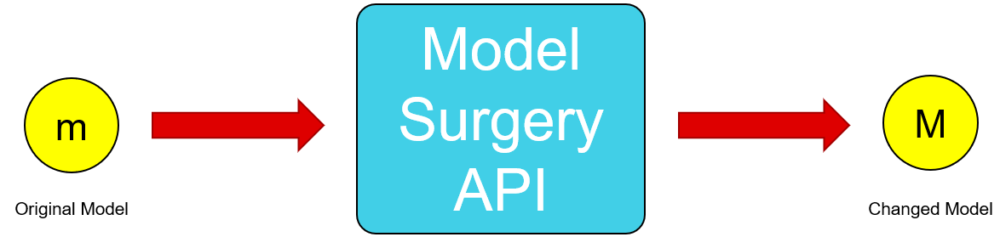<br>
</center>

---

## Table of Content
---
- [Table of Content](#table-of-content)
- [Main API (Usages)](#main-api-usages)
  - [get\_replacement\_dict\_default](#get_replacement_dict_default)
  - [replace\_unsupported\_layers function](#replace_unsupported_layers-function)
  - [SurgeryModule Class](#surgerymodule-class)
  - [Example](#example)
    - [Example Model](#example-model)
    - [Onnx Export before any change](#onnx-export-before-any-change)
    - [Example of Replacement Dictionary:](#example-of-replacement-dictionary)
    - [function to change according to replacement dict](#function-to-change-according-to-replacement-dict)
    - [Onnx Export before any change](#onnx-export-before-any-change-1)
- [Basics](#basics)
  - [Symbolic Trace](#symbolic-trace)
  - [Intermediate Representation (Graph)](#intermediate-representation-graph)
  - [Components of Graph](#components-of-graph)
  - [Node Objects](#node-objects)
  - [Code Generation](#code-generation)
- [Single Node Replacement Process](#single-node-replacement-process)
- [Main API (Explained)](#main-api-explained)
  - [Getting Default Replacement Dict](#getting-default-replacement-dict)
  - [Replacing Pattern with Replacement:](#replacing-pattern-with-replacement)
  - [About SurgeryModule Class](#about-surgerymodule-class)
- [Different Types of Possible Replacement Rules](#different-types-of-possible-replacement-rules)
  - [Replacement Type 1 (Module to Module change)](#replacement-type-1-module-to-module-change)
  - [Replacement Type 2 (Function to Function change)](#replacement-type-2-function-to-function-change)
  - [Replacement Type 3 (Function to Type/Module change)](#replacement-type-3-function-to-typemodule-change)
  - [Replacement Type 4 (Type to Type/Module change)](#replacement-type-4-type-to-typemodule-change)
  - [Replacement Type 5 (Custom Surgery Function)](#replacement-type-5-custom-surgery-function)
- [Other Module Components](#other-module-components)
  - [replacer.py](#replacerpy)
    - [**get\_parent\_name**](#get_parent_name)
    - [**replace\_module\_node**](#replace_module_node)
    - [**replace\_function\_nodes**](#replace_function_nodes)
    - [**\_are\_both\_node\_equal**](#_are_both_node_equal)
    - [**straight\_chain\_searcher**](#straight_chain_searcher)
    - [**\_replace\_pattern**](#_replace_pattern)
    - [**\_replace\_all\_matches**](#_replace_all_matches)
    - [**graph\_pattern\_replacer**](#graph_pattern_replacer)
  - [custom\_surgery\_functions.py](#custom_surgery_functionspy)
    - [**replace\_resize\_with\_scale\_factor**](#replace_resize_with_scale_factor)
    - [**\_replace\_pool\_size\_ge\_5**](#_replace_pool_size_ge_5)
    - [**replace\_maxpool2d\_kernel\_size\_ge\_5**](#replace_maxpool2d_kernel_size_ge_5)
    - [**replace\_avgpool2d\_kernel\_size\_ge\_5**](#replace_avgpool2d_kernel_size_ge_5)
    - [**replace\_conv2d\_kernel\_size\_ge\_7**](#replace_conv2d_kernel_size_ge_7)
    - [**replace\_cnblock**](#replace_cnblock)
    - [**replace\_layer\_norm**](#replace_layer_norm)
    - [**remove\_identiy**](#remove_identiy)
  - [custom\_modules.py](#custom_modulespy)
    - [**SEModule**](#semodule)
    - [**SEModule1**](#semodule1)
    - [**InstaModule**](#instamodule)
    - [**Focus**](#focus)
    - [**ConvBNRModule**](#convbnrmodule)
    - [**ReplaceBatchNorm2D**](#replacebatchnorm2d)
    - [**ReplacementCNBlock**](#replacementcnblock)
- [Module Tested on till Date](#module-tested-on-till-date)
  - [**TorchVision Models:**](#torchvision-models)
  - [**TIMM Models:**](#timm-models)
  - [**mmYolo Models:**](#mmyolo-models)
- [Results](#results)
---

## Main API (Usages)
[<p align = 'right'>Go To Top</p>](#table-of-content)

---

### [convert_to_lite_fx function]()
```
changed_model = convert_to_lite_fx(model, replacement_dict=None)
```
- returns the module after all changes are done on the model, which are defined in the replacement_dict
- args:
  - model: the target model we have to surgery on
  - replacement_dict: the replacement rules in form of pattern(keys) and replacements(values). If repalcement_dict == None, it will take default replacement dict

### [SurgeryModule Class]()
```
changed_model = SurgeryModule(model, replacement_dict=None)
```
- creates a wrapper module that will apply the model surgery function inside.
- args:
  - model: the target model we have to surgery on
  - replacement_dict: the replacement rules in form of pattern(keys) and replacements(vals). If repalcement_dict == None, it will take default replacement dict

### [get_replacement_dict_default]()
- user can get the default replacement_dict used for surgery by using **get_replacement_dict_default()**
- returns the default replacement dictionary defined in the module
- user can then update the dictionary and pass it to the above apis.
```
replacement_dict = copy.deepcopy(get_replacement_dict_default())
replacement_dict.update({torch.nn.GELU: torch.nn.ReLU})
changed_model = convert_to_lite_fx(model, replacement_dict=replacement_dict)
```


### Example
#### Example Model
```
class ExampleModule(nn.Module):
    def __init__(self):
        super().__init__()
        self.left=nn.Sequential(
             surgery.custom_modules.Focus(),
             surgery.custom_modules.ConvBNRModule(12,16,7,stride=1,padding=3),
             surgery.custom_modules.SEModule(),
             nn.Conv2d(16,32,3,padding=1),
             nn.BatchNorm2d(32),
             nn.SiLU(),
             nn.ReLU6(),
             )
        self.right = nn.Sequential(
             surgery.custom_modules.ConvBNRModule(3,16,3,stride=1,padding=1),
             surgery.custom_modules.SEModule1(),
             surgery.custom_modules.ConvBNRModule(16,32,3,stride=2,padding=1),
        ) 
    def forward(self,x):
        return torch.nn.functional.gelu(torch.add(self.left(x),self.right(x)))

model = ExampleModule()
```

#### Onnx Export before any change
<center>
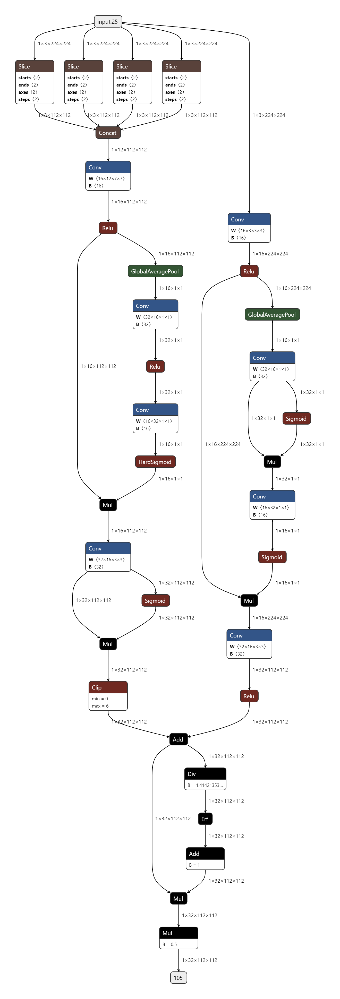
</center>

#### Example of Replacement Dictionary:
```
replacement_dict={
    #Type refers to class 
     surgery.custom_modules.SEModule1:nn.Identity(),# Type to Module (composite)
    #Module refers to Module Object
     surgery.custom_modules.Focus():surgery.custom_modules.ConvBNRModule(3,12,5,stride=2,padding=2),# Type to Module
     surgery.custom_modules.SEModule():nn.Identity(),# Module to Module 
     nn.SiLU:nn.ReLU, # Type to Type (singular)
     nn.ReLU6(): nn.ReLU(),# Module to Module
     torch.nn.functional.gelu:nn.ReLU(), # function to Type/Module
     torch.add:torch.sub, #function to function
     'conv kernel 7':surgery.custom_surgery_functions.replace_conv2d_kernel_size_ge_7 # custom surgery function
}
```

#### function to change according to replacement dict

```
changed_model = surgery.replace_unsupported_layers(model,replacement_dict=replacement_dict)
```

#### Onnx Export after change
<center>
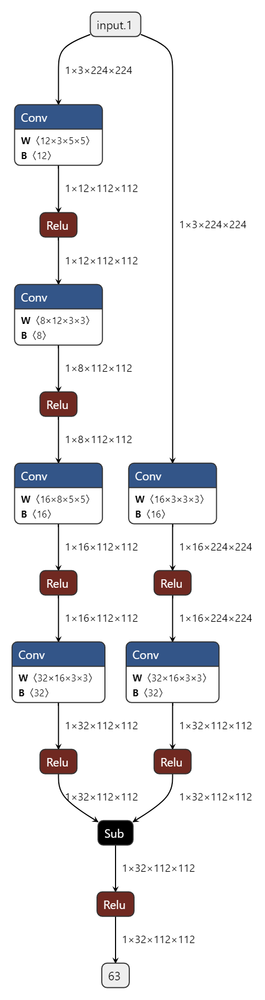
</center>

---

## Basics 
[<p align = 'right'>Go To Top</p>](#table-of-content)

---
This API uses functionalities from the package [torch.fx](https://pytorch.org/docs/stable/fx.html) package to change the model. 

This package says to change the model, we have to go through 3 steps.
> 1. [Symbolic Trace](#symbolic-trace)
> 1. Modification in the [Intermediate Representation](#intermediate-representation) (Graph)
> 1. [Code Generation]()

<center>
<br>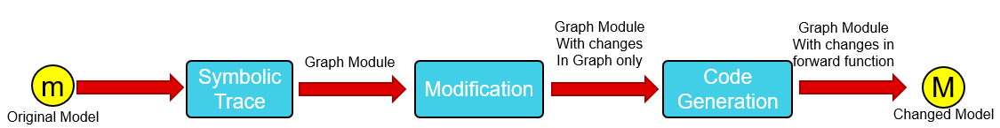<br>
</center>

### [Symbolic Trace](https://pytorch.org/docs/stable/fx.html#torch.fx.symbolic_trace)
It is the process of performing **“symbolic execution”** of the Python code. It feeds fake values, called **Proxies**, through the code. Operations on theses Proxies are recorded.

Code:
```
class ExampleModule(nn.Module):
    def __init__(self):
        super().__init__()
        self.param = torch.rand(1,3,224,224)
        self.act= nn.ReLU()
    def forward(self,x):
        return self.act(x.permute(0,1,2,3)+self.param)

model= ExampleModule()
from torch.fx import symbolic_trace
traced_model=symbolic_trace(model)
print(traced_model)
```

Output:
```
ExampleModule(
  (act): ReLU()
)

the container for the operations that were recorded during symbolic tracing. It consists of a list of Nodes that represent function inputs, call-sites (to functions, methods, or torch.nn.Module instances), and return values
def forward(self, x):
    permute = x.permute(0, 1, 2, 3);  x = None
    param = self.param
    add = permute + param;  permute = param = None
    act = self.act(add);  add = None
    return act
```

After symbolic trace, [torch.nn.Module](https://pytorch.org/docs/stable/generated/torch.nn.Module.html#torch.nn.Module) object will be converted [torch.fx.GraphModule](https://pytorch.org/docs/stable/fx.html#torch.fx.GraphModule) object with its own graph and code. Due to this, Inner composite modules (i.e. which are made up of more sub module) will lose their forward functions which can be seen in the **code** attribute of main model's GraphModule along with the function calls and method calls of different intermediate objects.


### Intermediate Representation ([Graph](https://pytorch.org/docs/stable/fx.html#torch.fx.Graph))
It is the container for the operations that were recorded during symbolic tracing. It consists of a list of Nodes that represent function inputs, call-sites (to functions, methods, or [torch.nn.Module](https://pytorch.org/docs/stable/generated/torch.nn.Module.html#torch.nn.Module) instances), and return values.

Code:
```
print(traced_model.graph)
```

Output:
```
graph():
    %x : [#users=1] = placeholder[target=x]
    %permute : [#users=1] = call_method[target=permute](args = (%x, 0, 1, 2, 3), kwargs = {})
    %param : [#users=1] = get_attr[target=param]
    %add : [#users=1] = call_function[target=operator.add](args = (%permute, %param), kwargs = {})
    %act : [#users=1] = call_module[target=act](args = (%add,), kwargs = {})
```
Graph also can be printed in tabular way using its [print_tabular](https://pytorch.org/docs/stable/fx.html#torch.fx.Graph.print_tabular). For that we have to install package called '[tabulate](https://pypi.org/project/tabulate/)' using following command:

``` shell
pip install tabulate
```

Code:
```python
traced_model.graph.print_tabular()
```

Output:
```
opcode         name     target                   args              kwargs
-------------  -------  -----------------------  ----------------  --------
placeholder    x        x                        ()                {}
call_method    permute  permute                  (x, 0, 1, 2, 3)   {}
get_attr       param    param                    ()                {}
call_function  add      <built-in function add>  (permute, param)  {}
call_module    act      act                      (add,)            {}
output         output   output                   (act,)            {}
```

<center>
<br>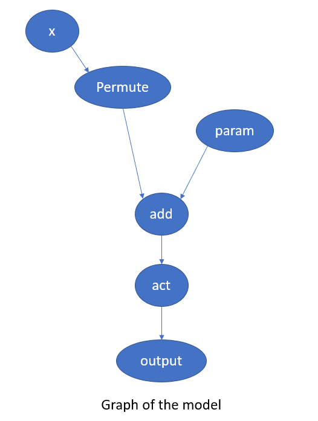<br>
</center>

Graph records the operation in 6 categories:
1. **placeholder** -> inputs
    - like x, y, inp
2. **output** -> final output of the model (tuple of all output provided by the model)
    - only a single node of this type
3. **get_attr** -> to get any attribute of intermediate objects
    - also for parameters stored as attributes of modules
4. **call_method**  -> to access any method of different objects used in forward passing
   - for Tensor: permute,add,sub,mul,etc 
5. **call_function** -> to access any function that will work on differnt objects and can be used in forward function
   - for torch: torch.permute, torch.add,etc
   - for +, -, etc: operator.add, operator.sub, etc
6. **call_module** -> to accessing primary module like instances of class in (nn.Conv2d,nn.BatchNorm2d,nn.ReLU,etc) in side the module structure

> **Note:** All Model will generate a directed acyclic graph as once an operation is done in the input in forward passing it will add a new node for it, hence preventing any cycle of nodes and direction will be the flow of the data between the nodes.


### Components of Graph
Graph has the following attributes: 
- **nodes:** of node_list type which has all the nodes in a topological order
<center>
<br>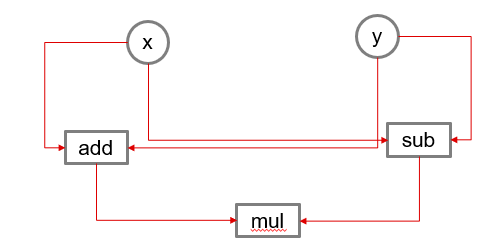<br>
</center>
For example, in the above graph the node_list will be:
<br><b><center>[x,y,add,sub,mul]</center></b>

- various functions for different purposes:
  - inserting nodes:
    - [insert_after](https://pytorch.org/docs/stable/fx.html#torch.fx.Graph)(Node n)
    - [insert_before](https://pytorch.org/docs/stable/fx.html#torch.fx.Graph)(Node n)
  - deleting nodes:
    - [erase_node](https://pytorch.org/docs/stable/fx.html#torch.fx.Graph)(Node n)
  - creating nodes:
    - [call_function](https://pytorch.org/docs/stable/fx.html#torch.fx.Graph.call_function)(*args,**kwargs)
    - [call_method](https://pytorch.org/docs/stable/fx.html#torch.fx.Graph.call_method)(*args,**kwargs)
    - [call_module](https://pytorch.org/docs/stable/fx.html#torch.fx.Graph.call_module)(*args,**kwargs)
  - cheking if graph is correctly designed or not
    - [lint](https://pytorch.org/docs/stable/fx.html#torch.fx.Graph.lint)()
  - printing the graph:
    - [print_tabular](https://pytorch.org/docs/stable/fx.html#torch.fx.Graph.print_tabular)()


### Node Objects
Node generally contains the following attributes:
- **Name**: its name
- **Op**: its operation (call_function, call_method, call_module, placeholder, output)
- **Target**: where does it stores data intermediately for the forwarding the data for call_module and call_method or instace for function incase of it is a call_function node
- **Next and Prev**: Next and previous nodes of it in the node list of graph
- **Users**: a dictionary of nodes those use the output of this node 
- **Args**: argument passed to it. It also contains the node address it takes input from
- **Kwargs**: kwyword argument passed to it. It also contains the node address it takes input from
<center>
<br>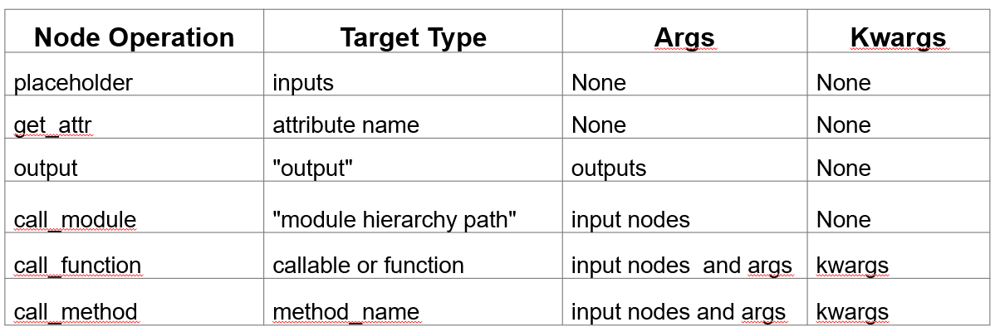<br>
</center>
### Code Generation
After changing the nodes in the graph, we can generate a code for the graph that will be the forward function for the module. After that, the module structure, graph and the forward code for the model in wrapper object of class [torch.fx.GraphModule](https://pytorch.org/docs/stable/fx.html#torch.fx.GraphModule). So,

<b><p align = 'center'>Graph Module = Module Structure + Graph + Code</p></b> 

Code:
```python
print(traced_model.code)
```

Output:
```
def forward(self, x):
    permute = x.permute(0, 1, 2, 3);  x = None
    param = self.param
    add = permute + param;  permute = param = None
    act = self.act(add);  add = None
    return act
```

While forward passing an input through the GraphModule, this code is iterated over as it is actually stored as a string in the data structure.
 
---

## Single Node Replacement Process
For replacing single node, **node** in Graph Module **traced_model**:
1. with **call_method**
```py
with traced_model.graph.insert_after(node):
    new_node= traced_model.graph.call_method(replacement_method,args,kwargs):
    node.replace_all_uses_with(new_node)
traced_model.graph.erase_node(node)
```
Here replcement is also a method, so, **call_method** is used. Args must contain the previous nodes and any required arguement and kwargs must contain all requiered keyword arguements for the new method.

2. with **call_function**
```py
with traced_model.graph.insert_after(node):
    new_node= traced_model.graph.call_function(replacement_func,args,kwargs):
    node.replace_all_uses_with(new_node)
traced_model.graph.erase_node(node)
```
Here replcement is also a function, so, **call_function** is used. Args must contain the previous nodes and any required arguement and kwargs must contain all requiered keyword arguements for the new function.

3. with **call_module**
```python
traced_model.add_submodule(new_node_name,replacement_module)
with traced_model.graph.insert_before(node):
    new_node= traced_model.graph.call_module(new_node_name,args,{}):
    node.replace_all_uses_with(new_node)
traced_model.graph.erase_node(node)
```
Here replcement is also a module, so,it is first added to the structure and using the target name, **call_module** is called to create a new_node. Args must contain the previous nodes and kwargs must be empty as modules don't need keyword arguments.

If target node is **call_module** node we can directly replace the module from the structure by replacing the module in the parent module of the target with the replacement module.

Parent Module can be reached from the dictionary returned by **name_modules()** of the Graph Module and target of the node.

<center><table>
<tr>
<th>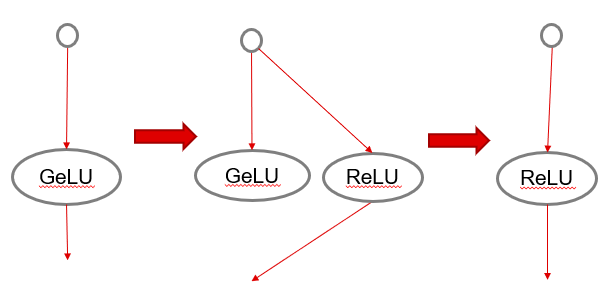  </th>
<th>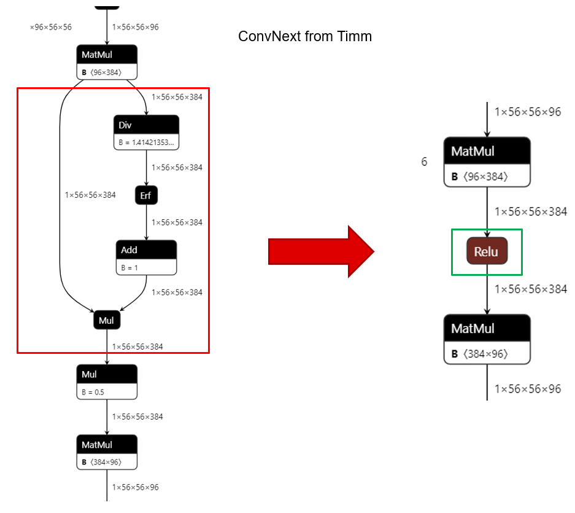</th>
</tr>
<tr>
<th><b>GeLU to ReLU</b></th>
<th><b>Change in ONNX export of the model</b></th>
</tr>
</table></center>

Here, we are changing GeLU with ReLU which can be done with pair pattern(GeLU) present in the model and any of call_fucntion or call_module of ReLU

## Main API (Explained)
[<p align = 'right'>Go To Top</p>](#table-of-content)

---
As previously said in section [Main API (Usages)](#main-api-usages), this API provides user with following functionalities in [surgery.py](https://bitbucket.itg.ti.com/projects/EDGEAI-ALGO/repos/edgeai-modeltoolkit/browse//v2/xmodelopt/surgery/surgery.py):

- [get_replacement_dict_default](#get_replacement_dict_default)
- [replace_unsupported_layer function](#replace_unsupported_layers-function)
- [SurgeryModule Class](#surgerymodule-class) 

### Getting Default Replacement Dict
Definition:
```
def get_replacement_dict_default():
```
- returns the default replacement dict that is used module
- it contains all the rules that are used for replacement
> **Note**: For efficient replacement rules should be organized in such a way that they will fulfil the following requirements:
> - replacements for pattern with larger number of nodes should come at the top in all type of replacements
>   - e.g.: Squeeze and Excite Layer before any Activation layer used in it.
> - if one layer is replaced with another instance of same type and another layer of a different type is to be replaced with same type, then former type of replacement should happen first then later should come.
>   - e.g. ReLU(inplace=True) to ReLU() before ReLU6() to ReLU()'

### Replacing Pattern with Replacement:
```python
def replace_unsupported_layer(model:nn.Module, replacement_dict=None):
```
- returns the module after all changes are done on the model, which are defined in the replacement_dict
- args:
  - model: the target model we have to surgery on
  - replacement_dict: the replacement rules in form of pattern(keys) and replacements(vals) 
    - if repalcement_dict == None, it will take default replacement dict
  
This function iterates through the replacement_dict and performs surgery according to the pair of pattern(keys) and replacement(values). 
<center>
<br>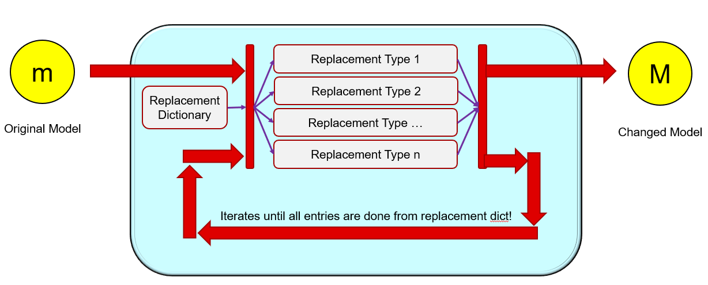<br>
</center>

---

## Different Types of Possible Replacement Rules
[<p align = 'right'>Go To Top</p>](#table-of-content)

---
There are 5 type of replacement rules implemented in the API, which are as following:
1. [Module to Module change](#replacement-type-1-module-to-module-change)
2. [Fucntion to Function change](#replacement-type-2-function-to-function-change)
3. [Function to Type/Module change](#replacement-type-3-function-to-typemodule-change)
4. [Type to Type/Module change](#replacement-type-4-type-to-typemodule-change)
5. [Custom Surgery Function](#replacement-type-5-custom-surgery-function)

### Replacement Type 1 (Module to Module change)
This approach is used when we don’t have to care about parameter (args and kwargs except nodes) passed to the pattern module.
It consists of two main process:
- symbolic trace both main module and pattern for graph
- searching of provided pattern in the node_list of the main model’s graph
- replacing them with the replacement

> Note: if modules in torch.nn directory are given for symbolic trace without any wrapper module, they will be converted to their respective functional counter parts.
> 
>  e.g.: nn.ReLU() -> nn.functional.relu()

**Searching pattern in the graph**

For this we use node_lists of both main model’s graph and pattern’s graph.
- After that this will be a simple linear pattern search in a linear list after discarding input nodes and output node.
- For comparing nodes in both graph, we first match their operation (op) and then follow according to the following table:
<center>
<br>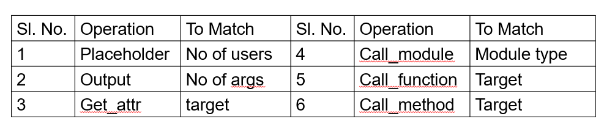 
</center>
Note: Till Date, Pattern with either single node or single input and single output is supported for replacement	

**Replacing the matches**

When we find the start and end of the matches of pattern in main model’s graph, replacement will be done as following cases:
1. If each of pattern and replacement is consists of single call_function or call_method node:
   - corresponding node for replacement’s node will be created and replaced with pattern’s node.
2. If start is a call_module node: 
    - corresponding module for that node will be changed from the structure
3.  else:
    - module will be added to the module structure and a new call_module node will be created for it for replacement in the graph.

Possible candidate for change:<br>

| Pattern            | Replacement   |
|--------------------|---------------|
| SqueezeAndExcite	  | nn.Identity() |
| nn.Dropout(…)	  | nn.Dropout()  |	
| nn.Hardswish()     | nn.ReLU()     |
| nn.GeLU()		  | nn.ReLU()     |


All this functionalities are availabe in [replacer.py](https://bitbucket.itg.ti.com/projects/EDGEAI-ALGO/repos/edgeai-modeltoolkit/browse//v2/xmodelopt/surgery/replacer.py) file which will be discussed later.

For patterns and Replacements which are composite models, some of them are defiend in [custom_modules.py](https://bitbucket.itg.ti.com/projects/EDGEAI-ALGO/repos/edgeai-modeltoolkit/browse//v2/xmodelopt/surgery/custom_.py) file.

<center><table>
<tr>
<th>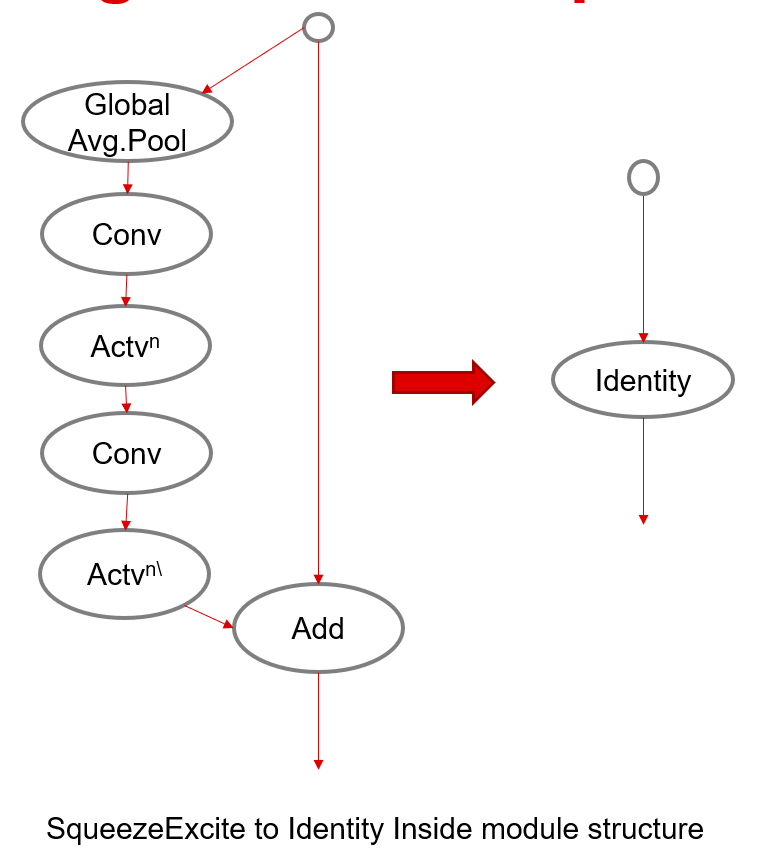  </th>
<th>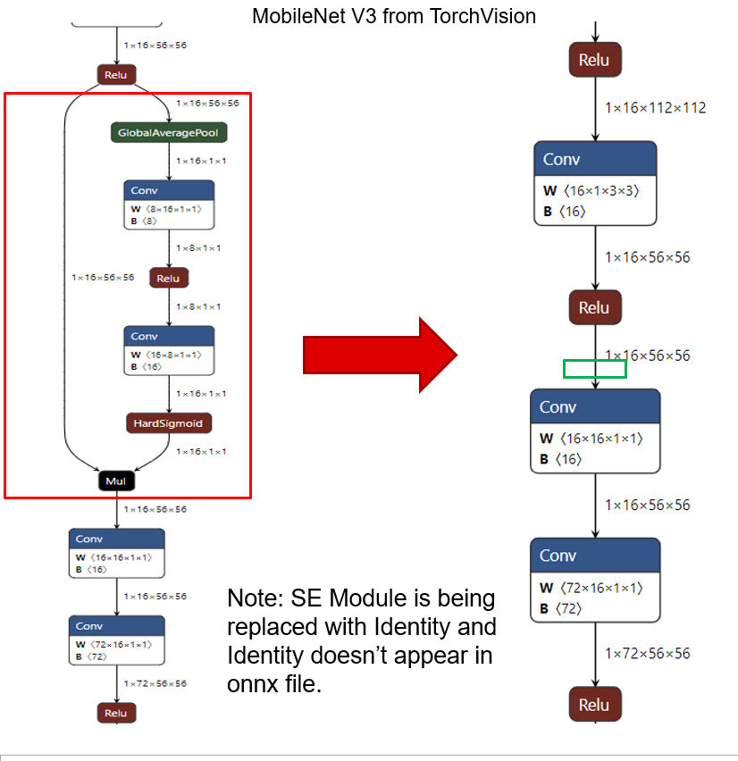</th>
</tr>
<tr>
<th><b>Squeeze And Excite to Identity </b></th>
<th><b>Change in ONNX export of the model</b></th>
</tr>
<tr>
<th>  </th>
<th></th>
</tr>
<tr>
<th><b>GeLU to ReLU</b></th>
<th><b>Change in ONNX export of the model</b></th>
</tr>
</table></center>


### Replacement Type 2 (Function to Function change)
This will call replace_function_node function that will create new node with replacement function as target with same args and kwargs.
Then it shifts the incoming and outgoing edges from the pattern to the new node.


<center><table>
<tr>
<th>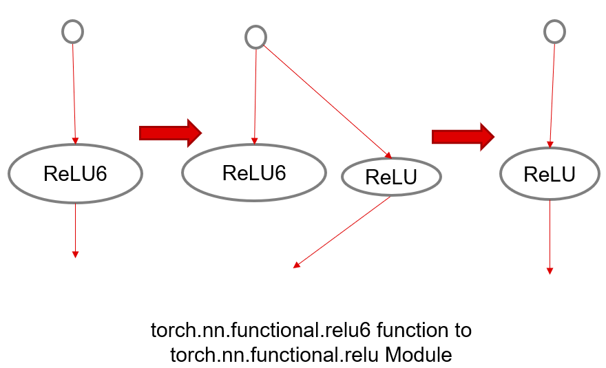  </th>
<th>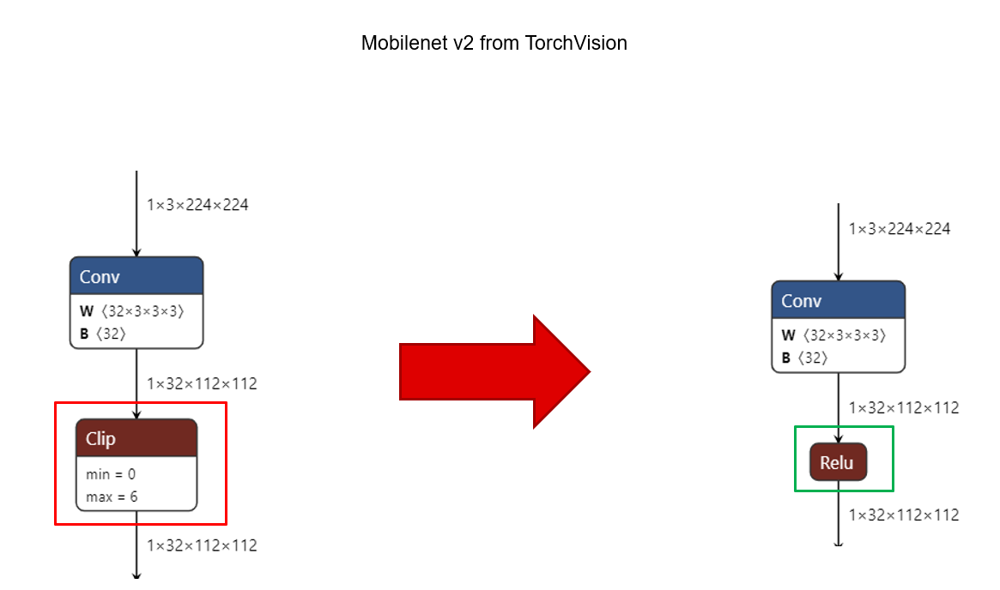</th>
</tr>
<tr>
<th><b>ReLU6 to ReLU </b></th>
<th><b>Change in ONNX export of the model</b></th>
</tr>
</table></center>


### Replacement Type 3 (Function to Type/Module change)
This will call replace_function_node function that will create new node with replacement module after adding it to module structure as target with same args.
  - as module don’t take kwargs in their nodes.
  
Then it shifts the incoming and outgoing edges from the pattern to the new node

<center><table>
<tr>
<th>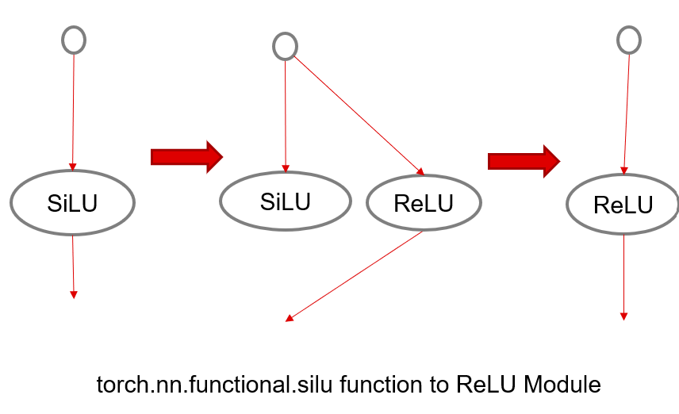  </th>
<th>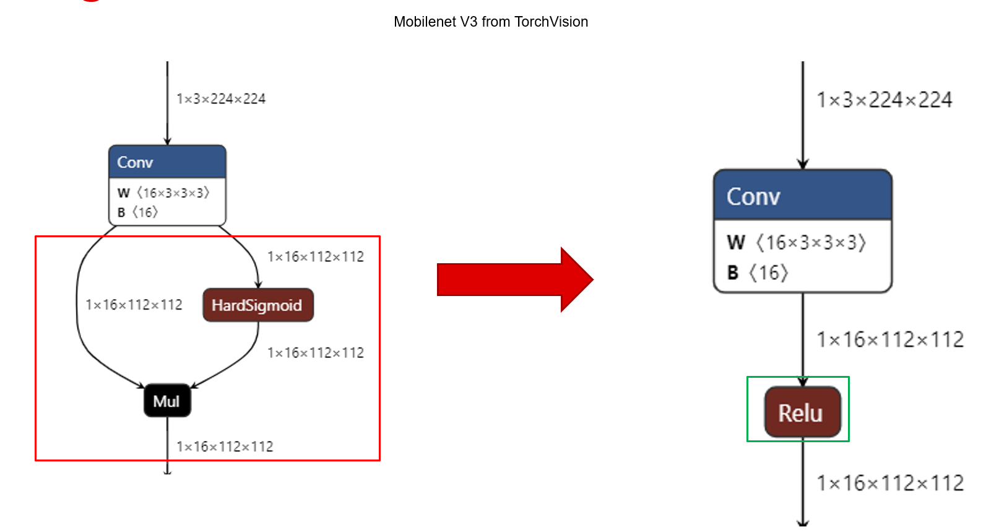</th>
</tr>
<tr>
<th><b>SiLU to ReLU </b></th>
<th><b>Change in ONNX export of the model</b></th>
</tr>
</table></center>

### Replacement Type 4 (Type to Type/Module change)
This replacement calls a function called replace_module_nodes which uses traditional approach of changing module from attribute of their parents
- so this useful if we know class of repetitive blocks in the model that doesn’t take parameters
  - e.g.: SEModule in timm models to Identity

It is better to be used before any symbolic trace is done on the model as after that all user defined models will lose their forward function and become instance Module class.
- but the (most of) module in torch.nn directory will retain their forward function even after symbolic trace until they are inside a wrapper module

<center><table>
<tr>
<th>  </th>
<th></th>
</tr>
<tr>
<th><b>Squeeze And Excite to Identity </b></th>
<th><b>Change in ONNX export of the model</b></th>
</tr></table></center>

### Replacement Type 5 (Custom Surgery Function)
Users also can add their own surgery functions that will return the changed model paired their callable with any value other than callable.
- These function must be made where we have change parameters (args and kwargs)
- These must return the changed graph module after surgery.
    - e.g.:	
        1. LayerNorm to BatchNorm
        <center><table>
        <tr>
        <th>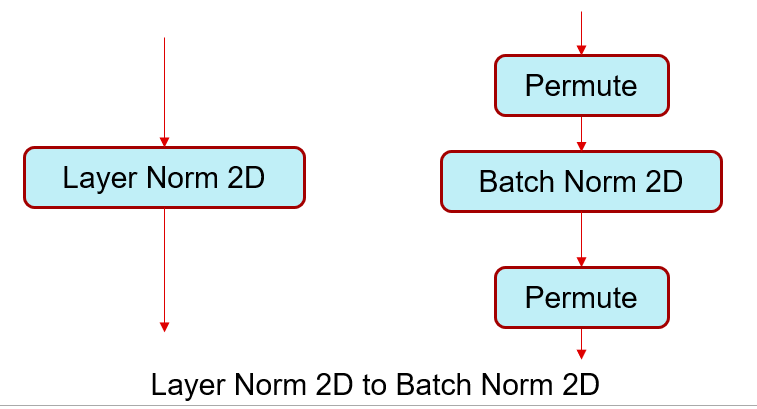  </th>
        <th>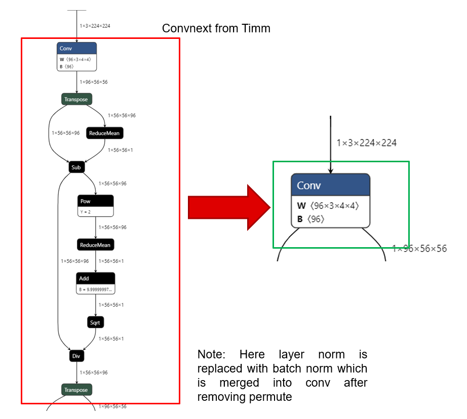</th>
        </tr>
        <tr>
        <th><b>LayerNorm to BatchNorm2d </b></th>
        <th><b>Change in ONNX export of the model</b></th>
        </tr></table></center>
		2. Conv. with kernel size greater than five : Equivalent series of Conv. of kernel 	  size 3 and a Conv. of kernel 5, etc
        <center><table>
        <tr>
        <th>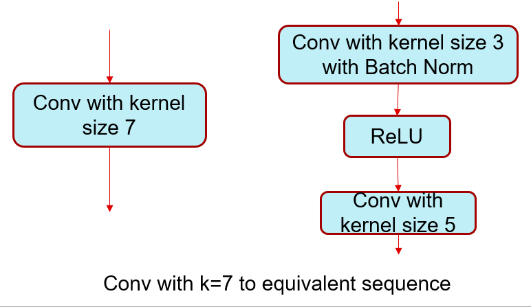  </th>
        <th>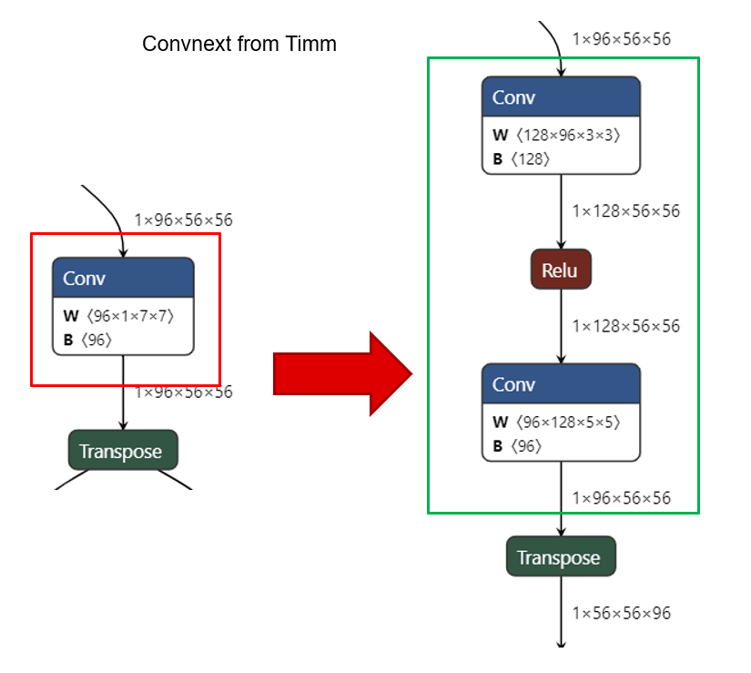</th>
        </tr>
        <tr>
        <th><b>Conv2D with kernel_size = 7  to equivalent series of Conv2D with kernel_size = 3 and a Conv2D with kernel_size = 5 </b></th>
        <th><b>Change in ONNX export of the model</b></th>
        </tr></table></center>
Example for these custom functions are available in [custom_surgery_functions.py](https://bitbucket.itg.ti.com/projects/EDGEAI-ALGO/repos/edgeai-modeltoolkit/browse//v2/xmodelopt/surgery/custom_surgery_functions.py)

---
## Other Module Components
[<p align = 'right'>Go To Top</p>](#table-of-content)

---
This repository contains 3 functionality files except main API file:

1. [replacer.py](#replacerpy)
2. [custom_modules.py](#custom_modulespy)
3. [custom_surgery_function.py](#custom_surgery_functionspy)

### [replacer.py](https://bitbucket.itg.ti.com/projects/EDGEAI-ALGO/repos/edgeai-modeltoolkit/browse//v2/xmodelopt/surgery/replacer.py)

This file contains all the functions used generic surgery method [replacement type 1 Module to Module Change](#replacement-type-1-module-to-module-change) which are listed below:

#### **get_parent_name**
Definition:
```py
def _get_parent_name(target:str):
```
- returns the name of the parent module and attribute name of the module from the target of the module
  
#### **replace_module_node**
Definition:
```py
def replace_module_nodes(model,pattern,replacement):
```
- replaces a  modules of pattern type to replacement module in the module structure

#### **replace_function_nodes**
Definition:
```py
def replace_function_nodes(model,pattern_function,replacement,kwargs=None):
```
- replaces a call function node to node with replacement function
  
#### **_are_both_node_equal**
Definition:
```py
def _are_both_node_equal(first_node:Node,second_node:Node,first_graoh_module:Union[GraphModule,None]=None,second_graph_module:Union[GraphModule,None]=None):
```
- checks whether two nodes are equal or not.
- till now for two node to be same they must have same operation

<center>
<br>
</center>

#### **straight_chain_searcher**
Definition:
```py
def straight_chain_searcher(main_module:GraphModule,pattern_module:GraphModule):
```
- searches for straight pattern matches in node list of the graph 
    
- it only allows:
  1.  if pattern has one input and one output
  2. if pattern has only one node other than placeholders or output
- it uses previous function for comparing nodes 

#### **_replace_pattern**
Definition:
```py
def _replace_pattern(main_module:GraphModule,start:Node,end:Node,replace_module:nn.Module,no_of_module_replaced:int=0):
```
- replaces nodes from start node to end node with the replacement module, 
  1. if pattern has only a single operational node start and end wull be same then, it will check for replacement if it also has a single node.
  2. if it has only a single operational node, it will check if it is call function or call method node.
  3. if it is so, it will add respective node not a call module node
  4. else simple replacement for nodes from start to end

#### **_replace_all_matches**
Definition:
```py
def _replace_all_matches(main_module:GraphModule,matches,replace_module:nn.Module):
```
- replace all pattern from matches with a copy of replacement module
- it uses the previous function for each match.

#### **graph_pattern_replacer**
Definition:
```py
def graph_pattern_replacer(main_module:Union[GraphModule,nn.Module,callable],pattern_module:Union[GraphModule,nn.Module,callable],replace_module:Union[GraphModule,nn.Module,callable]):
```
- searches for all matches in the graph and replaces all of them with replacement module
- it uses [straight_chain_searcher](#straight_chain_searcher) to search all occurence of pattern and than replaces them using [replace_all_matches](#_replace_all_matches). 
  
>- [replace_module_node](#replace_module_node) used in [replacement type 4 type to type/module change](#replacement-type-4-type-to-typemodule-change).<br>
>- [replace_function_nodes](#replace_function_nodes) is used in [replacement type 2 function to function change](#replacement-type-2-function-to-function-change)
and [replacement type 3 function to type/module change](#replacement-type-3-function-to-typemodule-change).<br>
>- [Replacement type 1 module to module change](#replacement-type-1-module-to-module-change) uses [graph_pattern_replacer](#graph_pattern_replacer) function to call rest of the functions for its replacement.
>- For understanding those function utilities user can refer to the corresponding [type of replacement rules](#different-types-of-possible-replacement-rules). 

### [custom_surgery_functions.py](https://bitbucket.itg.ti.com/projects/EDGEAI-ALGO/repos/edgeai-modeltoolkit/browse//v2/xmodelopt/surgery/custom_surgery_functions.py)

This modules contain all custom made surgery function which can't be done in generic process with current development of the project.All of these function can be used in [replacement type 5 custom surgery function](#replacement-type-5-custom-surgery-function) so user can refer for their utilities and examples.

They all follow same syntax:
```py
def __function_name__(model:nn.Module): -> torch.fx.GraphModule
```

The functions are listed below: 
#### **replace_resize_with_scale_factor**
- replaces resize function either operating on size or scale factor to resize with scale factor only
- they can be visible DeepLabV3 models at the end.
#### **_replace_pool_size_ge_5**
- replaces any pool layer with kernel greater than equal to 5 to its equivalent series of pool of kernel size 2 or 3, given to it as a parameter along with the model.
- this is an exception for the previous section it is not used outside of this file.
- it takes model, class of the pool module and function of the pool that it has to match
- by default it takes max pool
#### **replace_maxpool2d_kernel_size_ge_5**
- uses [_replace_pool_size_ge_5](#_replace_pool_size_ge_5) to replace max pool layer with kernel greater than equal to 5 to its equivalent series of pool of kernel size 2 or 3,
#### **replace_avgpool2d_kernel_size_ge_5**
- uses [_replace_pool_size_ge_5](#_replace_pool_size_ge_5) to replace avg pool layer with kernel greater than equal to 5 to its equivalent series of pool of kernel size 2 or 3,
#### **replace_conv2d_kernel_size_ge_7**
- replaces conv layer with kernel greater than equal to 7 to its equivalent series of [ConvBNRModule](#convbnrmodule) of kernel size 3 and one Conv2d of kernel size 5,
- effective if kernel size is odd

#### **replace_cnblock**
- this is specifically made for ConvNext of torchvision, might work with other models
- This replaces CNBlock of Convnext which contains a Conv2d with kernel size 7, LayerNorm, GeLU and some linear and permute layer.
- This will replace CNBlock with [ReplacementCNBlock](#replacementcnblock)
#### **replace_layer_norm**
- Replaces Layer Norm with [ReplaceBatchNorm2D](#replacebatchnorm2d) or identity if it is after a Global Avg. Pool or Mean Layer
- after replacement all identities will be removed by [remove_identiy](#remove_identiy) 
- at the end consequetive permute nodes will be merged to reduce calculation, if possible, to identity also and after that new Identities will be removed.
#### **remove_identiy**
- removes nn.Identity() nodes.

### [custom_modules.py](https://bitbucket.itg.ti.com/projects/EDGEAI-ALGO/repos/edgeai-modeltoolkit/browse//v2/xmodelopt/surgery/custom_modules.py)

This file serves as a pool of custom made modules for all other files which can be used as pattern or replacement models. The models are listed below:

#### **SEModule**
- used as pattern for several model 
- can be replaced with identity
#### **SEModule1**
- used as pattern for several model 
- can be replaced with identity
#### **InstaModule**
- used as wrapper modulefor patterns which are present in torch.nn directory, as it is observed that, without this it will create a call_function node not a call_module node which is generally needed.
- automatically called in main API
#### **Focus**
- used as replacement for different models
- can be replaced with an equivalent Conv2d
#### **ConvBNRModule**
- used as or in replacement for different patterns
- as it represents a typicall sequence of Conv2d, BatchNorm2d and ReLU. 
#### **ReplaceBatchNorm2D**
- used as replacement for LayerNorm, only handling inputs of  dimension of 4, in different models
#### **ReplacementCNBlock**
- used for replacement for pattern like CNBlock in ConvNeXt form TorchVision

---
## Module Tested on till Date
[<p align = 'right'>Go To Top</p>](#table-of-content)

---
The following models have been modified using the API and default replacement dictionary and also tested for whether an expected can forward pass through them or not.

### **TorchVision Models:**
|Model|Rules|
|-----|-----|
|MobileNet V2|ReLU6 -> ReLU|
|MobileNet V3|SE -> identity<br>Hardswish -> ReLU|
|ConvNeXt|LayerNorm -> BatchNorm2D, <br>CNBlock of ConvNeXt to  its equivalent<br> 1. (Conv2D with kernel greater than 5<br> 2. LayerNorm -> BatchNorm2D<br>3. GeLU -> ReLU)|  
|EfficientNet|SiLU -> ReLU<br>SE -> Identity<br>|
|DeepLab V3|resize with size -> resize with scale factor<br>(any other depending on the version)|

### **TIMM Models:**
|Model|Rules|
|-----|-----|
|MobileNet V3|SE -> identity<br>Hardswish -> ReLU|
|ConvNeXt|LayerNorm -> BatchNorm2D, <br>CNBlock of ConvNeXt to  its equivalent<br> 1. (Conv2D with kernel greater than 5<br> 2. LayerNorm -> BatchNorm2D<br>3. GeLU -> ReLU)|
|EfficientNet|SiLU -> ReLU<br>SE -> Identity<br>|
|ResNet|(no change just tried)|
|RegNet|SiLU -> ReLU<br>SE -> Identity<br>|

For **swin transformer model**, We encountered an issue associated with LayerNorms while replacing them with BatchNorm2d as it contains LayerNorm handling input of dimension 3 which can't be handled by BatchNorm2d.


### **mmYolo Models:**

For [mmYolo](https://bitbucket.itg.ti.com/projects/EDGEAI-ALGO/repos/edgeai-mmyolo) Repository, surgery is given as a option to select whether to do or not for the user with default replacement dictionry in [export.py](https://bitbucket.itg.ti.com/projects/EDGEAI-ALGO/repos/edgeai-mmyolo/browse/projects/easydeploy/tools/export.py)


|Model|Rules|
|-----|-----|
|yolox|\<all\>|
|yolo v5|\<all\>|
|yolo v6|\<all\>|
|yolo v7|\<all\>|
|yolo v8|\<all\>|

---
## Results
[<p align = 'right'>Go To Top</p>](#table-of-content)

---
This API can change Unsupported activation layers, different variation Squeeze And Excite Layer, Layer Norm 2D, redundant Identities, Conv2D, MaxPool2D, AvgPool2D module with kernel size greater than supported one. 
This API also provides user the feature for selective replacement of layers
- after they satisfy the requirement for the pattern or a custom surgery function.

Here are some of the models tested and trained along with their accuracies before and after change:

|Model|Accuracy before |Accuracy After Change|
|-----|----|----|
|MobileNet V3 (large) (torchvision)|69.7|68.4|
|EfficientNet B0 (torchvision)|70.3|67.4|
||||
> **Note**: 
> - Here changes are the replacement specified in default replacement dictionary.
> - Each Model is only trained for 100 epochs

--- 

<p align ='right'>
Developed and Documented by:<br>
<b>Kunal Ranjan Patel</b><br>
Embedded Software Intern Under Mentor:<br> <b>Manu Mathew</b><br>
Texas Instrument, Bangalore, India
</p>