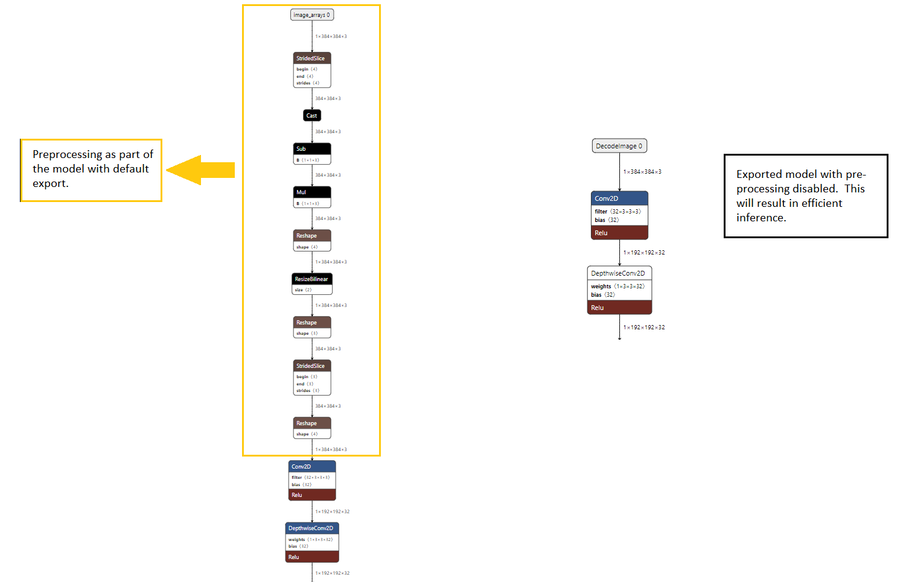

# Efficientdetlite Object Detection Models

## Introduction
* Efficientdet family of object detectors are based on efficientnet backbone and Bi_FPN feature extractor.<br>
* Efficientnet-lite is lighter version of efficientnet for edge applications. Similarly, lighter versions of Efficientdet with similar changes are called Efficientdet-lite. 
  
## Model Defintition and Training
* Here, we list certain models that are built on Efficientdet to make them TIDL friendly.
- Following changes were made from EfficientDet to get EfficientDet-lite:
    * Remove Squeeze and excitations.
    * Replace swish activations with ReLU.
    * Fast normalization feature fusion replaced with Simple addition
- Now, we list down changes specific to our models:
  * **EfficientDet-lite0_BiFPN_MaxPool2x2_ReLU** : This is a legacy model that we defined before Google came up with the EfficientDet-lite models. Following are the changes from  EfficientDet-lite:
    * (K=3,S=2) max-pooling replaced with (k=2,s=2) max-pooling.  
    * All max-pooling has a ReLU before it. 
    * ReLU activation instead of ReLU6.
  * **EfficientDet-lite_relu** : These models are our latest offering and are almost same as official EfficientDet-lite models with similar accuracy. 
    * The only difference being the activation function. These models use ReLU activation instead of ReLU6.
    * These models are finetuned from official ckpts for 3 epochs by running the following command:
      ```
      python main.py --mode=train_and_eval --train_file_pattern=coco/images/tfrecords/train2017/*.tfrecord --val_file_pattern=coco/images/tfrecords/val2017/*.tfrecord --model_name=efficientdet-lite0  --model_dir=checkpoints/efficientdet-lite0  --ckpt=ckpt_official/efficientdet-lite0  --train_batch_size=48  --eval_batch_size=48  --num_epochs=3  --strategy=gpus
      ```
    * Training these models require couple of changes in [google/automl](https://github.com/google/automl/tree/master/efficientdet) repository inside [hparams_config.py](https://github.com/google/automl/blob/master/efficientdet/hparams_config.py).
        * Change act_type='relu6' to act_type='relu'.
        * Since, we are finetuning from a checkpoint, we tune the learning rate parameters accordingly.
          * h.learning_rate = 0.01 (default h.learning_rate = 0.08)
          * h.lr_warmup_init = 0.001 (default h.lr_warmup_init = 0.008)

## Model Export
* All models can be exported using the script provided in [google/automl](https://github.com/google/automl/tree/master/efficientdet)  repository. Exported models are different than the EfficientDet-lite models that are hosted in [TF hub](https://hub.tensorflow.google.cn/tensorflow/efficientdet/lite0/detection/1). Currently, TIDL supports lite models exported using [automl](https://github.com/google/automl/tree/master/efficientdet) repository. Run the follwing command to generate tflite models that can be accelerated on TIDL using TFLite Runtime: 
  ```
        python model_inspect.py --runmode=saved_model --model_name=efficientdet-lite0   --ckpt_path=checkpoints/efficientdet-lite0  --saved_model_dir=checkpoints/efficientdet-lite0/tflite --tflite_path=checkpoints/efficientdet-lite0/tflite/efficientdet-lite0.tflite
  ```
  
* Unlike the official models, our example models don't have any preprocessing as part of the model as shown below. This will result in efficient inference. 
<br/> 
<p align="center">

</p>     

  
* In order to disable the preprocesing inside the tflite model during export, apply this [patch](./assets/0001-Disable-pre-processing.patch) on commit id **39c39e5**:

## Hosted Models  
* Given below is the summary of the models that we have trained and compare them against the official models.

    |Dataset |Model Name                              |Input Size |GigaMACS  |AP[0.5:0.95]|Available|Notes |
    |--------|----------------------------------------|-----------|----------|--------------------|---|----- |
    |COCO    |EfficientDet-lite0_BiFPN_MaxPool2x2_ReLU|512x512    |**2.50**  |33.61               |Y|Legacy model|
    |COCO    |EfficientDet-lite0                      |320x320    |**0.98**  |26.41               | |Official model|
    |COCO    |EfficientDet-lite0_relu                 |320x320    |**0.98**  |26.3                | |Finetuned from official ckpt|
    |COCO    |EfficientDet-lite1                      |384x384    |**1.98**  |31.50               | |Official model|
    |COCO    |EfficientDet-lite1_relu                 |384x384    |**1.98**  |31.79               |Y|Finetuned from official ckpt|
    |COCO    |EfficientDet-lite2                      |448x448    |**3.40**  |35.06               | |Official model|
    |COCO    |EfficientDet-lite2_relu                 |448x448    |**3.40**  |35.52               | |Finetuned from official ckpt|
    |COCO    |EfficientDet-lite3                      |512x512    |**7.52**  |38.77               | |Official model|
    |COCO    |EfficientDet-lite3_relu                 |512x512    |**7.52**  |38.33               |Y| Finetuned from official ckpt        |      |


## References

[1] EfficientDet: Scalable and Efficient Object Detection, Mingxing Tan, Ruoming Pang, Quoc V. Le, https://arxiv.org/abs/1911.09070 
[2] Brain AutoML, github.com/google/automl, https://github.com/google/automl
[3] EfficientNet: Rethinking Model Scaling for Convolutional Neural Networks, Mingxing Tan, Quoc V. Le, https://arxiv.org/abs/1905.11946
[4] Higher accuracy on vision models with EfficientNet-Lite, Renjie Liu, https://blog.tensorflow.org/2020/03/higher-accuracy-on-vision-models-with-efficientnet-lite.html
