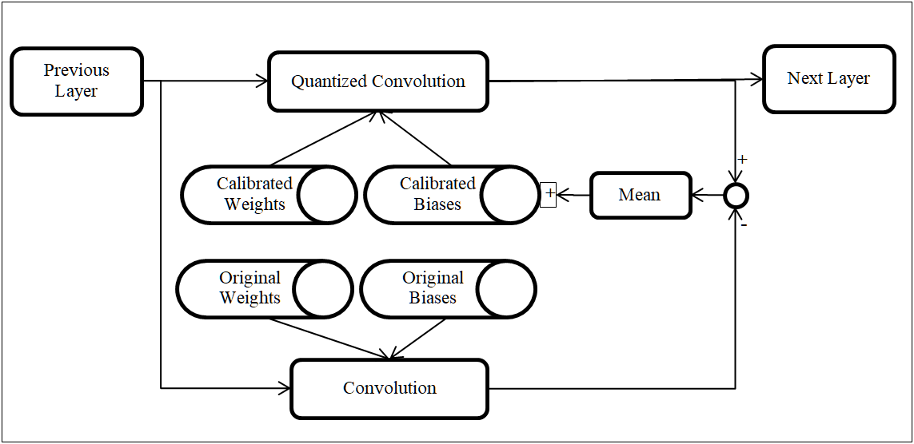

## Post Training Calibration For Quantization (a.k.a. Calibration)
**Note: this is not our recommended method in PyTorch.**<br>
Note: Post Training Calibration or simply Calibration is a method to reduce the accuracy loss with quantization. This is an approximate method and does not require ground truth or back-propagation - hence it is suitable for implementation in an Import/Calibration tool. We have simulated this Calibration scheme in PyTorch and can be used as fast method to improve the accuracy of Quantization. However, in a training frame work such as PyTorch, it is possible to get better accuracy with Quantization Aware Training - hence we suggest to use [Quantization Aware Training](./Quantization.md).

Post Training Calibration & Quantization can take a model trained in floating point and with a few steps convert it to a model that is friendly for quantized inference. Compared to the alternative (Trained Quantization), the advantages of this method are:
- Calibration is fast - a typical calibration finishes in a few minutes.
- Ground truth is not required - just input images are sufficient.
- Loss function or backward (back-propagation) are not required.

The disadvantage is:
- This is a fast and approximate method of quantizing the model and may not always yield the best accuracy.

In Post Training Calibration, the training happens entirely in floating point. The inference (possibly in an embedded device) happens in fixed point. In between training and fixed point inference, the model goes through the step called Calibration with some sample images. The Calibration happens in PC and Quantized Inference happens in the embedded device. Calibration basically tries to make the quantized output similar to the floating point output - by choosing appropriate activation ranges, weights and biases.

A block diagram of Post Training Calibration is shown below:
<p float="left">  </p>

Depending on how the activation range is collected and Quantization is done, we have a few variants of this basic scheme.
- Simple Calib: Calibration includes PACT2 for activation clipping, running average and range collection. In this method we use min-max for activation range collection (no histogram).
- **Advanced Calib**: Calibration includes PACT2 with histogram based ranges, Weight clipping, Bias correction.
- Advanced DW Calib: Calibration includes Per-Channel Quantization of Weights for Depthwise layers, PACT2 with histogram based ranges, Weight clipping, Bias correction. One of the earliest papers that clearly explained the benefits of Per-Channel Quantization for weights only (while the activations are quantized as Per-Tensor) is [[6]]

Out of these methods, **Advanced Calib** is our recommended Calibration method as of now, as it has the best trade-off between the Accuracy and the features required during fixed point inference. All the Calibration scripts that we have in this page uses "Advanced Calib" by default. Other Calibration methods described here are for information only.

In order to do Calibration easily we have a developed a wrapper module called QuantCalibrateModule, which is located in torchvision.edgeailite.xnn.quantize.QuantCalibrateModule. We make use of a kind of Parametric Activation called **PACT2** in order to store the calibrated ranges of activations. PACT2 is a improved form of PACT [[1]]. **PACT2 uses power of 2 activation ranges** for activation clipping. PACT2 can learn ranges very quickly (using a statistic method) without back propagation - this feature makes it quite attractive for Calibration. Our wrapper module replaces all the ReLUs in the model with PACT2. It also inserts PACT2 in other places where activation ranges need to be collected.  Statistical range clipping in PACT2 improves the Quantized Accuracy over simple min-max range clipping.

#### What happens during Calibration?
- For each iteration perform a forward in floating point using the original weights and biases. During this pass PACT2 layers will collect output ranges using histogram and running average.
- In addition, perform Convolution+BatchNorm merging and quantization of the resulting weights. These quantized and de-quantized weights are used in a forward pass. Ranges collected by PACT2 is used for activation quantization (and de-quantization) to generate quantized output.
- The floating point output and quantized output are compared using statistic measures. Using such statistic measures, we can adjust the weights and biases of Convolutions and Batch Normalization layers - so that the quantized output becomes closer to the floating point output.
- Within a few iterations, we should get reasonable quantization accuracy.

#### How to use  QuantCalibrateModule
As explained, the method of **Calibration does not need ground truth, loss function or back propagation.** However in the calibration script, we make use of ground truth to measure the loss/accuracy even in the Calibration stage - although that is not necessary.

The section briefly explains how to make use of our helper/wrapper module to do the calibration of your model. For further details, please see references.edgeailite.engine.train_classification.py and references.edgeailite.engine.train_pixel2pixel.py. The step by step process is as follows:

```
from torchvision.edgeailite import xnn

# create your model here:
model = ...

# create a dummy input - this is required to analyze the model - fill in the input image size expected by your model.
dummy_input = torch.rand((1,3,384,768))

#wrap your model in xnn.quantize.QuantCalibrateModule. Once it is wrapped, the actual model is in model.module
model = xnn.quantize.QuantCalibrateModule(model, dummy_input=dummy_input)

# load your pretrained weights here into model.module
pretrained_data = torch.load(pretrained_path)
model.module.load_state_dict(pretrained_data)

# create your dataset here - the ground-truth/target that you provide in the dataset can be dummy and does not affect calibration.
my_dataset_train, my_dataset_val = ...

# do one epoch of calibration - in practice about 1000 iterations are sufficient.
model.train()
for images, targets in my_dataset_train:
    output = model(images)
    # calibration doesn't need anything else here - not even the loss function.
    # so the targets are also not needed.

# save the model - the calibrated module is in model.module
# calibrated model can export a clean onnx graph with clips in eval mode.
model.eval()
torch.onnx.export(model.module, dummy_input, os.path.join(save_path,'model.onnx'), export_params=True, verbose=False, do_constant_folding=True, opset_version=9)
torch.save(model.module.state_dict(), os.path.join(save_path,'model.pth'))
```

Careful attention needs to be given to how the pretrained model is loaded and trained model is saved as shown in the above code snippet.

Few examples of calibration are provided below. These commands are also listed in the file **run_quantization.sh** for convenience.<br>

- Calibration of ImageNet Classification MobileNetV2 model
```
python ./references/edgeailite/scripts/train_classification_main.py --phase calibration --dataset_name image_folder_classification --model_name mobilenetv2_tv_x1 --data_path ./data/datasets/image_folder_classification --pretrained https://download.pytorch.org/models/mobilenet_v2-b0353104.pth --batch_size 64 --quantize True --epochs 1 --epoch_size 0.1
```

- Calibration of ImageNet Classification ResNet50 model
```
python ./references/edgeailite/scripts/train_classification_main.py --phase calibration --dataset_name image_folder_classification --model_name mobilenetv2_tv_x1 --data_path ./data/datasets/image_folder_classification --pretrained https://download.pytorch.org/models/resnet50-19c8e357.pth --batch_size 64 --quantize True --epochs 1 --epoch_size 0.1
```

- Calibration of Cityscapes Semantic Segmentation model
```
python ./references/edgeailite/scripts/train_segmentation_main.py --phase calibration --dataset_name cityscapes_segmentation --model_name deeplabv3plus_edgeailite_mobilenetv2_tv --data_path ./data/datasets/cityscapes/data --img_resize 384 768 --output_size 1024 2048 --gpus 0 1 
--pretrained ./data/modelzoo/pytorch/semantic_segmentation/cityscapes/jacinto_ai/deeplabv3plus_edgeailite_mobilenetv2_tv_resize768x384_best.pth 
--batch_size 12 --quantize True --epochs 1
```

## Guidelines, Implementation Notes, Limitations & Recommendations
- Please refer to the section on Quantization Aware Training, as the same guidelines, recomendations & limitations apply to QuantCalibrateModule.<br>
- An additional limitation is that multi gpu processing with DataParallel / DistributedDataParallel is not supported for QuantCalibrateModule (also for QuantTestModule). In our example training scripts train_classification.py and train_pixel2pixel.py in [references/edgeailite/engine](../../references/edgeailite/engine), we do not wrap the model in DataParallel if the model is QuantCalibrateModule or QuantTestModule. The original floating point training (without quantization) can use Multi-GPU as usual and we do not have any restrictions on that. (However multi gpu support with DataParallel works for QuantTrainModule - more details of this in the QAT section).<br>
