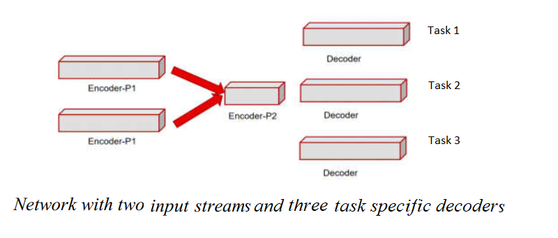

# Multi task Network

Multi task networks are trained to perform multiple tasks on a single inference of the network. Thus it saves on compute and hence suitable for real-time application. Theoretically, for correlated tasks, it further improve performance compared to each individual tasks. 

## Model
We will discuss an example network that uses two inputs (Optical flow, Current frame) and performs three tasks namely (depth, semantic and motion) for each input pixel. The model takes two inputs and three output as shown in the figure below:

<p float="centre">
  
</p> 

Two parallel encoders extract appearance and flow feature separately and fuse them at stride of 4. We have three separate decoders for each task whereas the encoder is common across all the tasks.


## Datasets: Cityscapes Multitask Datset
**Inputs:** The network takes (Optical flow, Current frame) as input. 
* **Optical flow** For optical flow input, copy the directory **leftimg8bit_flow_farneback_confidence** from this [repository](https://bitbucket.itg.ti.com/projects/ALGO-DEVKIT/repos/cityscapes_motion_dataset/browse) into ./data/datatsets/cityscapes/data/.
* **Current frame:**: This is can be downloaded from https://www.cityscapes-dataset.com/. Download the zip file leftImg8bit_trainvaltest.zip. keep the directory leftimg8bit in ./data/datatsets/cityscapes/data/. 

**Ground truth**
Since we are training  network to infer depth, semantic and motion together, we need to have the ground truth for all these tasks for common input.  
* **Depth:**  This is available from https://www.cityscapes-dataset.com/ . This folder named disparity must be kept in  ./data/datasets/cityscapes/data.
* **Semantic:** This is available from https://www.cityscapes-dataset.com/ as well. Keep the gtFine directory in ./data/datasets/cityscapes/data. 
* **Motion:** This [repository](https://bitbucket.itg.ti.com/projects/ALGO-DEVKIT/repos/cityscapes_motion_dataset/browse) contains motion annotation inside **gtFine**. Move the gtFine directory into ./data/datatsets/cityscapes/data/.
Finally depth annotation must reside inside ./data/datasets/cityscapes/data whereas both the semantic and motion annotations must go inside ./data/datatsets/cityscapes/data/gtFine.

Now, the final directory structure must look like this:
```
./data/datatsets/cityscapes/data/
    leftimg8bit	                                               -  Current frame from cityscapes dataset 
    leftimg8bit_flow_farneback_confidence  -  Optical flow, confidence generated from (Curr_frame, Previous Frame) and stored in the format(u',v',confidence)
    gtFine	                                                -  Ground truth motion and semantic annotation
    depth                                                              -  Ground truth depth annotation
```

## Multi task learning: Learning task-specific weights
There are many practical challenges in training a network for multiple tasks without significant deterioration in performance. The first and foremost being the weight given to each task during training. Easier task may have a faster convergence and hence require lesser weightage. There have been significant advances on adaptively finding the optimum task-specific weight. We will discuss a couple of them here along with the vanilla multitask learning.

**Vanilla multi-task learning**: Here the weights are not learnt.They are all set to 1.0. To train a vanilla multi-task model run the following command, <br> 
``` 
python ./references/edgeailite/scripts/train_pixel2pixel_multitask_main.py  --img_resize 384 768 --output_size 1024 2048 --gpus 0 1 
```
**Gradient nornalization** : The weights are updated based on the norm of the backward gradient of the last common along with the rate of learning for each task. To train a model based on gradient normalization run the following command: <br>
```
python ./references/edgeailite/scripts/train_pixel2pixel_multitask_main.py  --multi_task_type pseudo_grad_norm --img_resize 384 768 --output_size 1024 2048 --gpus 0 1
```
**Uncertainty bassed learning**: In this case, the weights are updated based on homscedastic uncertainty. To train a uncertainty based multi-task model run the following command: <br>
```
python ./scripts/train_pixel2pixel_multitask_main.py --multi_task_type uncertainty --img_resize 384 768 --output_size 1024 2048 --gpus 0 1 
```

## Results:
## Cityscapes Multi Task Learning 
Depth Estimation, Semantic Segmentation(Five class), Motion Segmentation

| Training Modality                       | Depth(ARD%), Semantic(mIOU), Motion(mIOU) | Complexity (GigaMACS) |
|-----------------------------------------|-------------------------------------------|-----------------------|
| Single Task Training                    | 11.35, 86.71, 86.6                        |   3.44, 3.54, 3.92    |
| Vanilla Multi Task Training             | 12.31, 82.32, 80.52                       |          5.71         |
| Gradient-norm based Multi Task Learning | 12.64, 85.53, 84.95                       |          5.71         |
| Uncertainty based Multi Task Training   |----- , -----, -----                       |          5.71         |

## References
[1] The Cityscapes Dataset for Semantic Urban Scene Understanding, Marius Cordts, Mohamed Omran, Sebastian Ramos, Timo Rehfeld, Markus Enzweiler, Rodrigo Benenson, Uwe Franke, Stefan Roth, Bernt Schiele, CVPR 2016, https://www.cityscapes-dataset.com/

[2] A. Kendall, Y. Gal, and R. Cipolla. Multi-task learning using uncertainty to weigh losses for scene geometry and semantics. In CVPR, 2018.

[3] Z. Chen, V. Badrinarayanan, C. Lee, and A. Rabinovich. GradNorm: Gradient normalization for adaptive loss balancing in deep multitask networks. In ICML, 2018.
