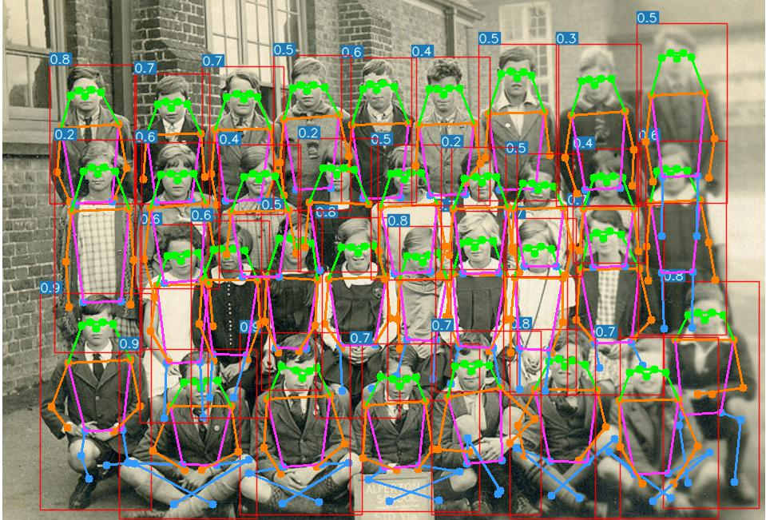
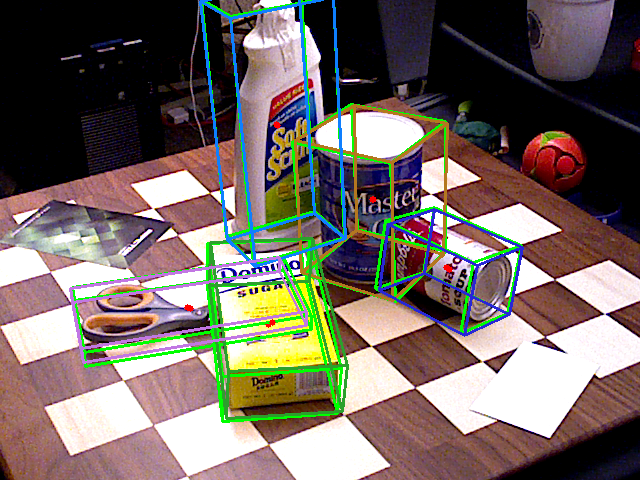

# edgeai-yolox

### Notice: This repository is not maintained and the setup may not readily work.

Recommend the following alternatives instead of this:
* For Object Detection, **edgeai-mmdetection** can be used.
* For Keypoint Detection **edgeai-mmpose** can be used.

<hr>

## YOLOX based Models
This repository is a fork of [YOLOX](https://github.com/Megvii-BaseDetection/YOLOX). This contains the enhancements of the YOLOX repository for supporting additional tasks and embedded friendly ti_lite models. 


### Installation

#### Step1. Install YOLOX.
```
./setup.sh
```

#### Step2. Install [pycocotools](https://github.com/cocodataset/cocoapi).
```
pip3 install cython; pip3 install 'git+https://github.com/cocodataset/cocoapi.git#subdirectory=PythonAPI'
```

### Tasks supported
* **2D Detection (with Ti-lite models)** 
    * These YOLOX based 2D detection models are optimized for TI processors. 
    * Refer to this [readme](./README_2d_od.md) for further details.

* **6D Pose Estimation** 
    * 6D pose estimation or object pose estimation aims to estimate the 3D orientation and 3D translation of objects in a given environment.  In this work, we propose a multi-object 6D pose estimation framework by enhancing the YOLOX object detector. The network is end-to-end trainable and detects each object along with its pose from a single RGB image without any additional post-processing.
    * Refer to this [readme](./README_6d_pose.md) for further details.

* **Keypoint Detection / Human Pose Estimation** 
    * Multi person 2D pose estimation is the task of understanding humans in an image. Given an input image, target is to detect each person and localize their body joints. In this work, we introduce a novel heatmap-free approach for joint detection, and 2D multi-person pose estimation in an image based on the popular YOLO object detection framework. 
    * In general, this can be called Keypoint Detection or 2D Pose Estimation.  
    * Refer to [readme](./README_keypoint_detection.md) for further details.

### Sample Inferences
* Given below are sample inferences for the tasks of human pose estimation and 6d pose estimation.

     Human Pose Estimation   | 6D Pose Estimation 
    :-------------------------:|:-------------------------:
     | 


### Note:
See the [original documentation](README_megvii.md)
