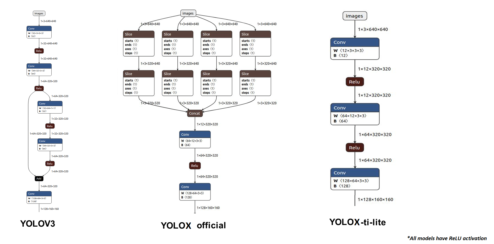
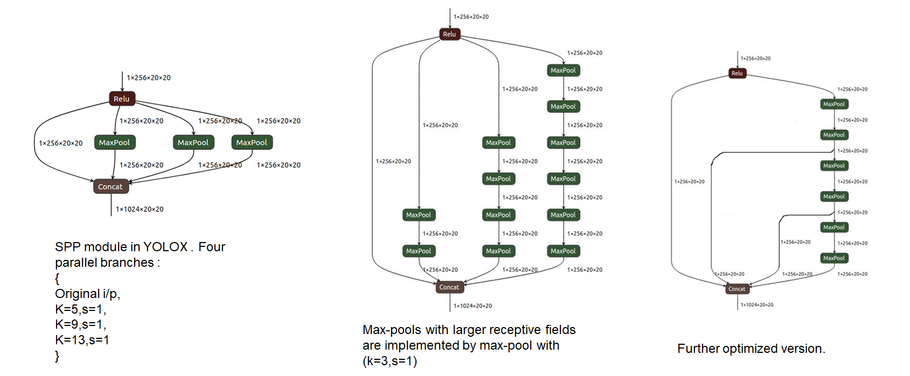

## YOLOX-ti-lite Object Detection Models
This repository is based on [Megvii/YOLOX](https://github.com/Megvii-BaseDetection/YOLOX). As per the [Official documentation](./README_megvii.md), YOLOX is an anchor-free version of YOLO, with a simpler design but better performance! It aims to bridge the gap between research and industrial communities. It has the following major differences rom YOLOv3:

* Darknet-csp backbone instead of vanilla Darknet. Reduces complexity by 30%. 
* PANet feature extractor instead of FPN.
* YOLOX detection head and label assignement is based on FCOS and OTA.  
  * It uses decoupled head. There are three subheads for each detection head. They are {class score head, box head, object score head}
  * Center sampling is used that assigns the center 3x3 areas as positive.
  * Label assignment is based on a simplified version of OTA, called SimOTA.
* Anchor free object detection reduces the complexity of the Detection layer.
  * There are 3x less detection candidates compared to YOLOv3 and YOLOv5.
  * Box-decoding is much simpler than other YOLO variants as well.
* Several new augmentation techniques as in YOLOv5. E.g. Mosaic augmentation. 
* All models are trained from scratch. There is no need for imagenet pretraining because of strong augmentation.
* YOLOX-Nano-ti-lite uses regular convolution instead of depth-wise convolution.

For more details, please refer to Megvii's [report on Arxiv](https://arxiv.org/abs/2107.08430).


### Official Models from Megvii.

#### Standard Models.

|Model |size |mAP<sup>val<br>0.5:0.95 |mAP<sup>test<br>0.5:0.95 | Speed V100<br>(ms) | Params<br>(M) |FLOPs<br>(G)| weights |
| ------        |:---: | :---:    | :---:       |:---:     |:---:  | :---: | :----: |
|[YOLOX-s](./exps/default/yolox_s.py)    |640  |40.5 |40.5      |9.8      |9.0 | 26.8 | [github](https://github.com/Megvii-BaseDetection/YOLOX/releases/download/0.1.1rc0/yolox_s.pth) |
|[YOLOX-m](./exps/default/yolox_m.py)    |640  |46.9 |47.2      |12.3     |25.3 |73.8| [github](https://github.com/Megvii-BaseDetection/YOLOX/releases/download/0.1.1rc0/yolox_m.pth) |

#### Smaller Models.

|Model |size |mAP<sup>val<br>0.5:0.95 | Params<br>(M) |FLOPs<br>(G)| weights |
| ------        |:---:  |  :---:       |:---:     |:---:  | :---: |
|[YOLOX-Nano](./exps/default/nano.py) |416  |25.8  | 0.91 |1.08 | [github](https://github.com/Megvii-BaseDetection/YOLOX/releases/download/0.1.1rc0/yolox_nano.pth) |
|[YOLOX-Tiny](./exps/default/yolox_tiny.py) |416  |32.8 | 5.06 |6.45 | [github](https://github.com/Megvii-BaseDetection/YOLOX/releases/download/0.1.1rc0/yolox_tiny.pth) |

## **YOLOX-ti-lite model definition**
* YOLOX-ti-lite is a version of YOLOX from TI for efficient edge deployment. This naming convention is chosen to avoid possible conflict with future release of YOLOX-lite models from Megvii.

* Here is a brief description of changes that were made to get YOLOX-ti-lite from YOLOX:
    * YOLOX has a Focus layer as the very first layer of the network. This replaces the first few heavy convolution layers that are present in YOLOv3. It reduces the complexity of the n/w by 7% and training time by 15%. However, the slice operations in Focus layer are not embedded friendly and hence we replace it with a light-weight convolution layer. Here is a pictorial description of the changes from YOLOv3 to YOLOX to YOLOX-ti-lite:
    <p align="left"></p>     

    * SiLU activation is not well-supported in embedded devices. it's not quantization friendly as well because of it's unbounded nature. This was observed for hSwish activation function while [quantizing efficientnet](https://blog.tensorflow.org/2020/03/higher-accuracy-on-vision-models-with-efficientnet-lite.html). Hence, SiLU activation is replaced with ReLU.
    * SPP module with maxpool(k=13, s=1), maxpool(k=9,s=1) and maxpool(k=5,s=1) are replaced with various combinations of maxpool(k=3,s=1).Intention is to keep the receptive field and functionality same. This change will cause no difference to the model in floating-point.
        *	maxpool(k=5, s=1) -> replaced with two maxpool(k=3,s=1)
        *	maxpool(k=9, s=1) -> replaced with four maxpool(k=3,s=1) 
        *   maxpool(k=13, s=1)-> replaced with six maxpool(k=3,s=1) as shown below:
        <p align="left"></p> 

### **Models trained by TI**

|Model |size |mAP<sup>val<br>0.5:0.95 |mAP<sup>val<br>0.5:0.95 | Params<br>(M) |FLOPs<br>(G)| weights |
| ------        |:---: | :---:| :---:    | :---:       |:---:     |:---:  | 
|[YOLOX-s-ti-lite](./exps/default/yolox_s_ti_lite.py) |640|39.1| 57.9      |9.0 | 26.9 |  |
|[YOLOX-m-ti-lite](./exps/default/yolox_m_ti_lite.py)|640  |45.5 | 64.2    |25.3 |73.8|  |
|[YOLOX-Nano-ti-lite](./exps/default/nano_ti_lite.py)|416  |25.8 | 41.6| 1.87 |2.06 |  |
|[YOLOX-Tiny-ti-lite](./exps/default/yolox_tiny_ti_lite.py)|416  |32.0|49.5  | 5.06 |6.48 |  |


## Training and Testing

<summary>Reproduce our results on COCO</summary>

```shell
python -m yolox.tools.train -n yolox-s-ti-lite -d 8 -b 64 --fp16 -o [--cache]
                               yolox-m-ti-lite
                               yolox-tiny-ti-lite
                               yolox-nano-ti-lite
```
* -d: number of gpu devices
* -b: total batch size, the recommended number for -b is num-gpu * 8
* --fp16: mixed precision training
* --cache: caching imgs into RAM to accelarate training, which need large system RAM. 

When using -f, the above commands are equivalent to:
```shell
python -m yolox.tools.train -f exps/default/yolox_s_ti_lite.py -d 8 -b 64 --fp16 -o [--cache]
                               exps/default/yolox_m_ti_lite.py
                               exps/default/yolox_tiny_ti_lite.py
                               exps/default/yolox_nano_ti_lite.py
```
<summary>Evaluation</summary>


```shell
python -m yolox.tools.eval -n  yolox-s-ti-lite -c yolox_s.pth -b 64 -d 8 --conf 0.001 [--fp16] [--fuse]
                               yolox-m-ti-lite
                               yolox-tiny-ti-lite
                               yolox-nano-ti-lite
```
* --fuse: fuse conv and bn
* -d: number of GPUs used for evaluation. DEFAULT: All GPUs available will be used.
* -b: total batch size across on all GPUs

## Deployment

[ONNX export and an ONNXRuntime](./demo/ONNXRuntime)

###  **ONNX export including detection:**

Run the following commands to export the entire models including the detection part. Use the flag "export-det" to add the extra post-processing. 

1. Convert a standard YOLOX model by -n:
```shell
python3 tools/export_onnx.py --output-name yolox_s.onnx -n yolox-s -c yolox_s.pth --export-det
```
Notes:
* -n: specify a model name. The model name must be one of the [yolox-s,m and yolox-nano, yolox-tiny, yolov3]
* -c: the model you have trained
* To customize an input shape for onnx model,  modify the following code in tools/export.py:

    ```python
    dummy_input = torch.randn(1, 3, exp.test_size[0], exp.test_size[1])
    ```

2. Convert a standard YOLOX model by -f. When using -f, the above command is equivalent to:

```shell
python3 tools/export_onnx.py --output-name yolox_s.onnx -f exps/default/yolox_s.py -c yolox_s.pth --export-det
```

* Apart from exporting the complete ONNX model, above script will generate a prototxt file that contains information of the detection layer. This prototxt file is required to deploy the moodel on TI SoC.

### ONNXRuntime Demo

Step1.
```shell
cd <YOLOX_HOME>/demo/ONNXRuntime
```
* With models that are exported end-to-end, inference becomes much simpler. The model takes an image as i/p and gives out the final detection. There is no need for any further post-processing. WHile inferring with a complete model, use the export-det flag as shown below

Step2. 
```shell
python3 onnx_inference.py -m <ONNX_MODEL_PATH> -i <IMAGE_PATH> -o <OUTPUT_DIR> -s 0.3 --input_shape 640,640 --export-det
```
Notes:
* -m: your converted onnx model
* -i: input_image
* -s: score threshold for visualization.
* --input_shape: should be consistent with the shape you used for onnx conversion.

### Pretrained Models

Pretrained models will be added under [pretrained_models](./pretrained_models)


## **References**

[1] [Official YOLOX repository](https://github.com/Megvii-BaseDetection/YOLOX) <br>
[2] [Official YOLOV5 repository](https://github.com/ultralytics/yolov5/) <br>
[3] [Focus layer]( https://github.com/ultralytics/yolov5/discussions/3181) <br>
[4] [CrossStagePartial Network](https://github.com/WongKinYiu/CrossStagePartialNetworkss)  <br>
[5] Chien-Yao Wang, Hong-Yuan Mark Liao, Yueh-Hua Wu, Ping-Yang Chen, Jun-Wei Hsieh, and I-Hau Yeh. [CSPNet: A new backbone that can enhance learning capability of
cnn](https://arxiv.org/abs/1911.11929). Proceedings of the IEEE Conference on Computer Vision and Pattern Recognition Workshop (CVPR Workshop),2020. <br>
[6]Shu Liu, Lu Qi, Haifang Qin, Jianping Shi, and Jiaya Jia. [Path aggregation network for instance segmentation](https://arxiv.org/abs/1803.01534). In Proceedings of the IEEE Conference on Computer Vision and Pattern Recognition (CVPR), pages 8759–8768, 2018 <br>
[7] [Efficientnet-lite quantization](https://blog.tensorflow.org/2020/03/higher-accuracy-on-vision-models-with-efficientnet-lite.html) <br>
[8] [FCOS: Fully Convolutional One-Stage Object Detection](https://github.com/tianzhi0549/FCOS) <br>
[9] [OTA: Optimal Transport Assignment for Object Detection](https://github.com/Megvii-BaseDetection/OTA)

